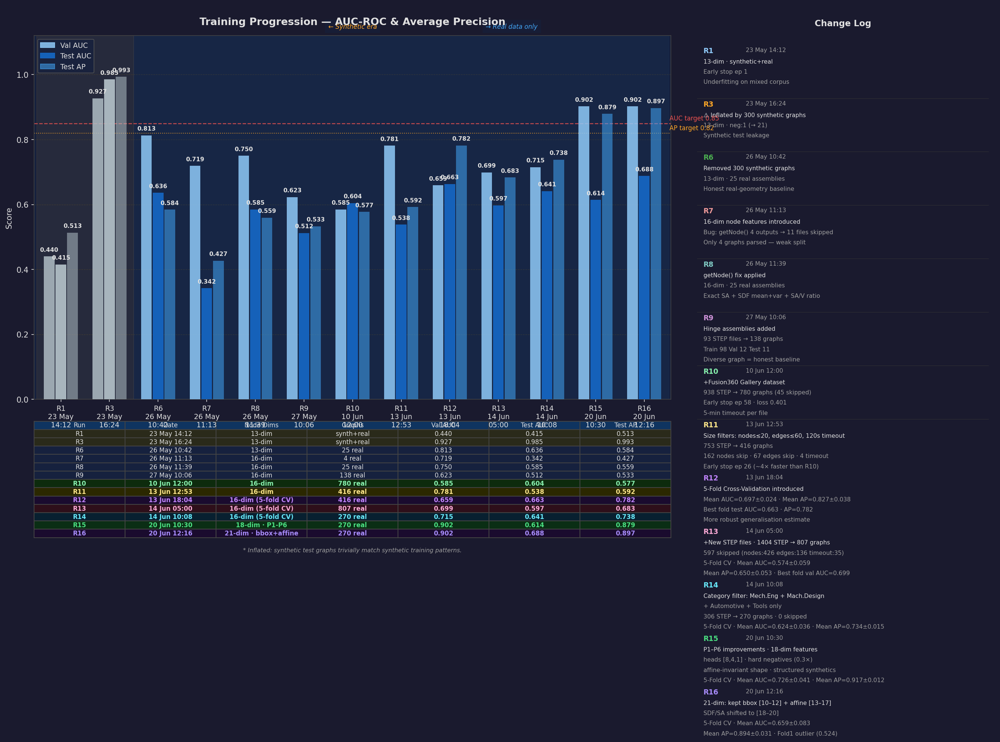

# AI-Assisted 3D Assembly Design

**Predicting Missing Components in CAD Assemblies using Graph Neural Networks**

| | |
|---|---|
| **Student** | Parthasarathy Perumal |
| **Programme** | M.Tech Data Science & AI, Sem 4 |
| **Guide** | Prof. Sagarika Borah |
| **University** | PES University, Electronic City, Bengaluru |
| **Phase 1** | May 10 – Jul 10, 2026 (Base replication) |
| **Phase 2** | Jul 10 – Sep 10, 2026 (Novelty & improvement) |

---

## Quick Start

```bash
# Clone and enter project
git clone <repo-url> && cd AI-Assisted-3D-Assembly-Design

# One command sets up everything
bash bootstrap.sh

# Add Gemini API key and review ports in .env
nano .env   # set GEMINI_API_KEY=... FRONTEND_PORT=... BACKEND_URL=...

# Activate environment
source .venv/bin/activate

# Start both services (reads ports from .env)
bash start_services.sh              # front-end :11501  · back-end :11000
bash stop_services.sh               # graceful shutdown

# Or run individually
streamlit run front_end/app.py      # 3D viewer only
cd back_end && python train.py      # GNN training
```

> Full setup guide → [`GETTING_STARTED.md`](./GETTING_STARTED.md)

---

## Abstract

Engineering CAD assemblies consist of multiple interconnected components whose correct selection is time-consuming and expertise-dependent. This project trains a **Graph Attention Network (GAT)** on assembly graphs to detect **missing components** via link prediction — Phase 1. A **Gemini-powered Skills AI agent** (AIDA) explains predictions in engineering language. An **Assembly Completeness Model** (`AssemblyTemplateDB`) learns per-category component-type distributions from training data and identifies what is missing when a partial or single-component file is uploaded. An **Octree-based Open Surface Detector** (inspired by the spatial partitioning technique in Borah & Borah 2020) identifies the precise mesh surfaces where missing components should be assembled, highlighting them in **lime green** directly on the 3D model — each open joint gets its own interactive legend entry. The solution is implemented entirely in Python using PyTorch Geometric, without dependency on proprietary CAD software APIs.

**Phase 2 (planned):** Next-component ranking via NodeRanker (cosine similarity, Hit@K, MRR).

---

## Problem Statement

Modern CAD tools (SolidWorks, CATIA, Fusion 360) offer no contextual intelligence during assembly creation. Engineers rely entirely on domain knowledge to choose and position each component.

| Pain Point | Description |
|---|---|
| **Knowledge barrier** | Junior engineers lack assembly patterns built over years of experience |
| **No automation** | Existing CAD tools offer no intelligent part suggestion during assembly creation |
| **Non-standardisation** | Different designers make inconsistent choices for equivalent subassemblies |
| **Incomplete assemblies** | Partially defined assemblies have no mechanism to detect or fill missing parts |

**Research Gap:** No existing system applies graph-based deep learning to recommend components from partial CAD assembly graphs without proprietary API dependency.

---

## System Architecture

```
Source_3d_models/ (STEP files)
         │
         ▼
dataset.py — gmsh (OpenCASCADE)
  Solid bodies → Nodes · Shared surfaces → Edges (2-dim)
  + trimesh exact SA · SDF ray-casting (SDF mean + variance)
  Nodes: 21-dim · PyG InMemoryDataset
  Saves sources.json (source path per graph) alongside data.pt
         │
         ▼
model.py — AssemblyGNN (3-layer GAT)
  21 → 1024 → 512 → 64 dim
  [8,4,1]-head attention · edge features on L1
         │
         ▼
LinkPredictor MLP  [Phase 1]
MLP(hᵤ‖hᵥ) → BCE
Missing component detection (AUC-ROC, AP)
         │
         ├──────────────────────────────────────────────────────┐
         ▼                                                       ▼
assembly_templates.py                               surface_analyzer.py
AssemblyTemplateDB                                  OctreeNode spatial partitioning
  • Groups training graphs by source folder           (Borah & Borah 2020 concept)
  • Computes median component-type counts           • After fragment(): free surfaces
    per category (hinge, shaft+bearing…)              (not shared between 2 bodies)
  • match() → assembly type + confidence            • Octree clusters nearby free
  • get_missing() → missing type list                 surface centroids into regions
  • Works for single-body uploads too               • Flags open mating joints
  • Cached to data/assembly_templates.json          • Returns triangle mesh per region
         │                                                       │
         └─────────────────────┬─────────────────────────────────┘
                               ▼
         ▼  (Phase 2 — planned)
NodeRanker · cosine_sim(ctx, cands)
Next-component ranking (Hit@K, MRR)
         │
         ▼
      skills_agent.py — Gemini AI (AIDA)
      Engineering explanation of predictions
                  │
                  ▼
         front_end/app.py — Streamlit
         Interactive 3D viewer + dual panel UI
         Left panel — 5 analysis sections:
           §0 Assembly type badge (purple)
           §1 Not assembled / under-connected (red) — deduplicated with ×N count badges
           §2 GNN missing links (blue) — deduplicated with ×N count badges
           §3 Auto-reference missing (orange)
           §4 Template missing components (teal)
           §5 Open surface joints (lime green)
         Right panel — 3D viewer (400 px, smooth shading, CharacteristicLengthMax=2.0):
           Red bodies = not assembled
           Orange ❓ = auto-reference missing
           Lime green ⬡ = open joints — one legend entry per joint, click to isolate
```

### Graph Schema

| Element | Dim | Features |
|---|---|---|
| **Node** | **21** | Type one-hot (8 classes, geometry-driven via SDF) · volume · exact SA (trimesh) · bbox Δx · bbox Δy · bbox Δz · elongation · flatness · aspect x/y · aspect y/z · sphericity · SDF mean · SDF variance · SA/V ratio |
| **Edge** | 2 | Mate type encoded (coincident/concentric/parallel/tangent/fixed/other) · weight |
| **Total assemblies** | 780 | 643 Fusion360 + 137 curated local |
| **Avg nodes/graph** | 31.8 (median 11) | Range: 2 – 448 |
| **Avg edges/graph** | 42.5 (median 12) | Range: 1 – 687 |
| **Train/Val/Test** | 70/15/15 | Split by assembly ID — no data leakage |

### Feature Engineering Detail (21 Node + 2 Edge Features)

The graph construction pipeline in `back_end/dataset.py` uses **gmsh + OpenCASCADE + trimesh + SDF ray-casting** to convert each STEP file into an attributed graph. Every solid body becomes a node; every detected physical contact becomes a bidirectional edge.

#### Node Features — 21 Dimensions

| Dim | Feature | Source | Status |
|---|---|---|---|
| [0–7] | Component type one-hot (8 classes) | SDF-inferred geometry rules | ✅ Geometry-driven (was hardcoded) |
| [8] | Normalised volume | `gmsh.occ.getMass()` | unchanged |
| [9] | **Exact** normalised surface area | `trimesh.Trimesh.area` | ✅ Exact (was bbox approximation) |
| [10] | **Bbox Δx** / bbox_max | `gmsh.occ.getBoundingBox()` | unchanged — absolute width |
| [11] | **Bbox Δy** / bbox_max | `gmsh.occ.getBoundingBox()` | unchanged — absolute height |
| [12] | **Bbox Δz** / bbox_max | `gmsh.occ.getBoundingBox()` | unchanged — absolute depth |
| [13] | **Elongation** — longest / mid axis | sorted bbox axes | ✅ New (R16) |
| [14] | **Flatness** — min / max axis | sorted bbox axes | ✅ New (R16) |
| [15] | **Aspect x/y** — dx/(dy+ε) normalised | `gmsh.occ.getBoundingBox()` | ✅ New (R16) |
| [16] | **Aspect y/z** — dy/(dz+ε) normalised | `gmsh.occ.getBoundingBox()` | ✅ New (R16) |
| [17] | **Sphericity** — π^⅓(6V)^⅔ / SA | gmsh + trimesh | ✅ New (R16) |
| [18] | **SDF mean** | Inward ray-casting (trimesh) | ✅ shifted from [15] |
| [19] | **SDF variance** | Inward ray-casting (trimesh) | ✅ shifted from [16] |
| [20] | **SA/V ratio** | exact_SA / volume | ✅ shifted from [17] |

**Dims [0–7] — Geometry-Driven Component Type One-Hot (8 classes)**

Each body is now classified by its geometry (SDF statistics + bounding-box ratios) rather than being hardcoded to "body":

| Index | Class | SDF signature |
|---|---|---|
| 0 | `body` | Generic fallback |
| 1 | `fastener` | Elongated (>2.5×) · thin walls (SDF mean < 8 % of long axis) |
| 2 | `bearing` | SDF std > 60 % of mean — bimodal ring topology |
| 3 | `shaft` | Strongly elongated (>3.5×) · SDF mean > 5 % of long axis |
| 4 | `plate` | Flatness ratio < 12 % (min bbox dim / max bbox dim) |
| 5 | `housing` | SDF variance > 20 % of mean² — complex wall geometry |
| 6 | `gear` | *(covered by housing rule for now; explicit gear rule Phase 2)* |
| 7 | `other` | *(reserved)* |

**Dim [8] — Normalised Volume**

Exact B-Rep volume via `gmsh.model.occ.getMass(3, tag)`, normalised by the maximum across all bodies in the assembly.

**Dim [9] — Exact Normalised Surface Area**

Surface area is now computed from the actual triangulated mesh via `trimesh.Trimesh.area`, eliminating the bbox approximation (`2(dx·dy + dy·dz + dz·dx)`) that was the single biggest accuracy flaw in the 13-dim baseline.

$$\text{Feature}[9] = \frac{\text{trimesh.area}_i}{\max(\text{trimesh.area across all bodies})}$$

**Dims [10–12] — Normalised Bounding Box Dimensions (Δx, Δy, Δz)**

$$\text{Feature}[10] = \frac{dx_i}{\text{bbox}_\text{max}}, \quad \text{Feature}[11] = \frac{dy_i}{\text{bbox}_\text{max}}, \quad \text{Feature}[12] = \frac{dz_i}{\text{bbox}_\text{max}}$$

Unchanged — encode relative size and aspect ratio of each body.

**Dims [13–14] — Shape Diameter Function (SDF mean + variance)**

The **Shape Diameter Function** approximates CGAL's SDF algorithm via trimesh inward ray-casting:
1. Sample N surface points; shoot a ray along the *inward* surface normal for each
2. Record the first-hit distance (local thickness at that point)
3. Aggregate across all sampled points → mean (avg thickness) and variance (shape complexity)

| SDF signature | Inferred component role |
|---|---|
| High mean, low variance | Shaft — uniformly thick cross-section |
| Low mean, low variance | Plate — uniformly thin |
| High variance | Housing or gear — varying wall thickness |
| Std > 60 % of mean | Bearing — bimodal thick/thin ring regions |

Both values are normalised by the maximum within the assembly before use as features.

**Dim [15] — Normalised SA/V Ratio**

Surface-area-to-volume ratio is a powerful discriminator between shells and solids that neither SA nor volume alone provides:

$$\text{Feature}[15] = \frac{(\text{exact\_SA}_i / \text{Volume}_i)}{\max(\text{SA/V across all bodies})}$$

Flat plates and thin shells have high SA/V; compact solid blocks have low SA/V.

#### Edge Features — 2 Dimensions

Edges are bidirectional (each contact produces two directed edges, one in each direction). Both share the same attribute vector.

**Dim [0] — Normalised Mate Type**

Encodes the category of the physical constraint between two contacting bodies. The vocabulary is:

| Index | Mate Type | Normalised Value | Meaning |
|---|---|---|---|
| 0 | `coincident` | 0.0 | Face-to-face planar contact (default for all detected contacts) |
| 1 | `concentric` | 0.2 | Shared axis — shaft through bore, bearing in housing |
| 2 | `parallel` | 0.4 | Parallel faces without touching |
| 3 | `tangent` | 0.6 | Curved surface touching flat or curved surface |
| 4 | `fixed` | 0.8 | Rigid ground constraint |
| 5 | `other` | 1.0 | Fallback — used when graph is fully connected due to no detected contacts |

> **Current baseline limitation:** All detected contacts are hardcoded to `0.0` (coincident) and all fallback edges to `1.0` (other) — `dataset.py` lines 115 and 123. True mate constraint type (concentric vs tangent etc.) is not extractable from raw STEP geometry alone; it requires CAD assembly constraint metadata. This limitation is acknowledged and carried forward as-is.

**Dim [1] — Edge Weight (Contact Presence)**

A scalar set to `1.0` for all edges in the current implementation, indicating the presence of a detected or inferred connection. No partial contact weighting is applied in Phase 1.

#### Geometric Extraction Mechanism in gmsh

The contact detection pipeline relies on two key gmsh operations:

**Step 1 — Boolean Fragmentation**

```python
gmsh.model.occ.fragment(volumes, [])
```

By default, STEP bodies are independent solids with no shared topology. The `fragment()` operation performs a Boolean intersection of all volumes against each other, forcing bodies that are physically touching to share the *exact same* boundary surface tags. Without this step, no shared surfaces exist and no edges can be detected.

**Step 2 — Boundary Surface Extraction**

```python
bnd = gmsh.model.getBoundary([(dim, tag)], oriented=False, combined=True)
body_surfs.append(frozenset(abs(s[1]) for s in bnd if s[0] == 2))
```

For each body the 2D boundary surface tags are collected into a `frozenset`. An edge is then created between body $i$ and body $j$ whenever their surface sets intersect:

```python
if body_surfs[i] & body_surfs[j]:
    # physical contact detected → add bidirectional edge
```

**Step 3 — Area Threshold (Inference / App Only)**

In `front_end/app.py`, contact detection during inference applies an additional area threshold to filter out numerical overlaps from slightly misaligned parts:

```python
_shared_sa = sum(gmsh.model.occ.getMass(2, st) for st in shared_surfaces)
if _shared_sa / _min_body_sa >= 0.01:   # shared area ≥ 1% of smaller body
    # valid mate contact
```

This threshold is applied only in the Streamlit inference path (not during training), as the training STEP files are assumed to be geometrically clean assemblies.

---

## Codebase

```
AI-Assisted-3D-Assembly-Design/
│
├── bootstrap.sh                 ← One-shot automated setup (uv + venv + deps + .env)
├── start_services.sh            ← Start front-end + back-end; reads ports from .env
├── stop_services.sh             ← Graceful shutdown (SIGTERM → SIGKILL); reads ports from .env
├── GETTING_STARTED.md           ← Full setup and usage guide
├── .env.example                 ← Environment template (copy → .env)
│
├── front_end/
│   ├── app.py                   ← Streamlit 3D viewer (dual-panel, sidebar controls)
│   └── requirements.txt
│
├── back_end/
│   ├── config.yaml              ← All hyperparameters + data paths
│   ├── dataset.py               ← STEP → PyG graph pipeline; 16-dim features; saves sources.json
│   ├── model.py                 ← AssemblyGNN · LinkPredictor · NodeRanker
│   ├── train.py                 ← Training loop · early stopping · checkpointing · builds template DB
│   ├── evaluate.py              ← AUC-ROC · AP · Hit@K · MRR · NDCG@K
│   ├── infer.py                 ← Inference on any STEP file or demo assembly
│   ├── skills_agent.py          ← Gemini AI orchestrator with engineering skills
│   ├── assembly_templates.py    ← AssemblyTemplateDB: per-category component-type distributions
│   ├── surface_analyzer.py      ← OctreeNode + analyze_open_surfaces() — open joint detection
│   ├── requirements.txt
│   ├── data/                    ← Processed graph cache (auto-generated)
│   │   ├── processed/
│   │   │   ├── data.pt          ← Collated PyG graph bundle
│   │   │   └── sources.json     ← Source STEP path per graph (for template DB)
│   │   └── assembly_templates.json  ← Template cache (built by train.py)
│   ├── checkpoints/             ← best.pt saved here during training
│   └── results/                 ← train_log.json + test_metrics.json
│
├── skills/
│   └── engineering_3d_assembly.yaml  ← AIDA skills profile (6 domain skill areas)
│
├── trained_models/              ← Timestamped model exports (git-ignored *.pt, folder tracked)
│
└── Source_3d_models/            ← 3D assembly STEP files for training (git-ignored)
```

### Key files

| File | What it does |
|---|---|
| `back_end/dataset.py` | Scans `Source_3d_models/` for STEP files; UUID-named individual body STEPs filtered out; per-file 5-min timeout via `multiprocessing` spawn — timed-out folders moved to `skipped_models/` with JSON report; gmsh+OCC for solid bodies/edges; trimesh exact SA; SDF ray-casting; geometry-driven type inference; 16-dim node features; saves `sources.json` alongside `data.pt` for template DB |
| `back_end/model.py` | 3-layer GAT encoder (16→512→256→64) + `LinkPredictor` MLP; `build_model()` returns `(gnn, lp, device)`; `NodeRanker` present in file, deferred to Phase 2 |
| `back_end/train.py` | Training loop: BCE loss + hard negatives, Adam + ReduceLROnPlateau, early stopping; saves `best.pt` + timestamped export; calls `AssemblyTemplateDB.build()` after training to cache templates |
| `back_end/evaluate.py` | `evaluate()` returns AUC-ROC and Average Precision — Phase 1 only; Hit@K / MRR / NDCG@K deferred to Phase 2 |
| `back_end/infer.py` | `predict_missing()` scores all absent node pairs and returns top-K with confidence; bar-chart CLI output |
| `back_end/skills_agent.py` | `AssemblySkillsAgent` — loads skills YAML, builds Gemini system prompt, exposes `explain_prediction()`, `identify_component()`, `suggest_assembly_sequence()`, `answer()` |
| `back_end/assembly_templates.py` | `AssemblyTemplateDB` — loads `data.pt` + `sources.json`, groups graphs by assembly category (top-level folder under `Source_3d_models/`), computes median component-type counts per category; `match()` returns best assembly type + confidence; `get_missing()` returns missing component list; handles single-body uploads |
| `back_end/surface_analyzer.py` | `OctreeNode` — lightweight 3-D octree for spatial grouping of surface centroids (adapted from Borah & Borah 2020 block decomposition). `analyze_open_surfaces()` — after boolean fragment(), identifies free surfaces (unmated) above area threshold, clusters them via Octree, extracts triangle mesh per region (handles type-2 and type-9 elements; `_synthetic_surface_mesh()` fallback guarantees a visible patch); returns open joint records for lime-green 3D overlay |
| `front_end/app.py` | Streamlit app — dual panels (both 400 px); 6-section left inference panel (assembly type, not-assembled with ×N dedup, GNN links with ×N dedup, auto-reference missing, template missing, open surface joints); 3D viewer with red/orange/lime-green overlays, smooth Phong shading, CharacteristicLengthMax=2.0; AIDA 4-section structured explanation with line-by-line HTML renderer |

---

## Skills AI (AIDA)

The project uses **Google Gemini** as an AI orchestrator configured with mechanical engineering domain knowledge.

### Pipeline

```
GNN predictions + node_degrees + open_surfaces (all three categories)
         │
         ▼
AssemblySkillsAgent  ←  skills/engineering_3d_assembly.yaml
         │                (persona + 6 skill domains + response rules)
         ▼
Gemini (gemini-2.0-flash)  [max_output_tokens=2500]
         │
         ▼
Structured 4-section explanation displayed in AIDA panel:
  === 1. Not Assembled / Not Properly Mated ===
  === 2. AI Predicted Missing Links ===
  === 3. Open Assembly Joints Detected ===
  === Overall Recommendation ===
```

### Skill domains

| Skill | Coverage |
|---|---|
| `mechanical_engineering` | Statics, materials, tolerancing (GD&T), design for manufacturing |
| `3d_modelling` | B-Rep, STEP/IGES, OpenCASCADE, solid modelling kernels |
| `3d_assembly_design` | Mate constraints, DOF, assembly hierarchies, sub-assemblies |
| `3d_parts_identification` | Body / fastener / bearing / shaft / plate / gear classification from geometry |
| `gnn_interpretation` | Reading AUC-ROC, AP, link confidence scores in engineering terms |
| `assembly_sequencing` | Build order, fixture requirements, interference analysis |

### Usage

```python
from back_end.skills_agent import AssemblySkillsAgent

agent = AssemblySkillsAgent()
print(agent.explain_prediction(
    missing=[((2, 5), 0.87), ((0, 3), 0.72)],
    recs=[],   # next-component recs added in Phase 2
    context="Lathe tailstock — 4 known components",
))
```

Set `GEMINI_API_KEY` in `.env`. The agent degrades gracefully (offline mode) without a key.

AIDA now produces a **structured 4-section response** covering all three analysis categories and an overall engineering recommendation. The prompt passes compact summaries of all three data categories (not-mated nodes grouped by unique name with counts, predicted links, open joint bodies) and explicitly instructs the model to complete all four sections with at most 3 bullets per section.

**AIDA panel rendering:** The response is parsed line-by-line into styled HTML — section headings (`=== … ===`) render in sky-blue bold, bullet lines (`*`, `-`) in bright white, and plain text in the same bright colour — so all four sections are fully legible on the dark blue gradient background. `html.escape()` is applied before injection to prevent special characters in the Gemini output from breaking the HTML structure.

---

## Environment Configuration (.env)

Copy `.env.example` → `.env` and fill in your values. Key sections:

| Section | Key variables |
|---|---|
| **Google Gemini** | `GEMINI_API_KEY` · `GEMINI_MODEL=gemini-2.0-flash` |
| **Skills AI** | `SKILLS_PROFILE=engineering_3d_assembly` · `SKILLS_TEMPERATURE=0.3` |
| **Frontend** | `FRONTEND_HOST=localhost` · `FRONTEND_PORT=11501` |
| **Backend** | `BACKEND_URL=http://localhost:11000` |
| **LLM** | *(placeholder for future LLM-specific keys)* |
| **Application** | `APP_ENV=development` · `LOG_LEVEL=INFO` · `SOURCE_3D_MODELS=<path>` |

`start_services.sh` and `stop_services.sh` both read `FRONTEND_PORT` and `BACKEND_URL` from `.env` automatically — no need to edit the scripts when changing ports.

---

## 3D Viewer (Front-end)

**Stack:** STEP → gmsh (OpenCASCADE) → STL → PyVista → Plotly `Mesh3d` → Streamlit

```bash
source .venv/bin/activate
bash start_services.sh          # starts Streamlit on FRONTEND_PORT (default 11501)
# or directly:
streamlit run front_end/app.py --server.port 11501
```

**Dual-panel layout:**

| Panel | Description |
|---|---|
| **Left — AI-Assisted Viewer** | Shows "Train first" if no checkpoint. After training: upload a STEP file → runs GNN inference → displays 5 stacked analysis sections (see below). |
| **Right — 3D Model Viewer** | Upload any STEP/STP file → gmsh converts → interactive Plotly 3D viewer. Bodies highlighted in red (not assembled), orange ❓ cross markers (auto-reference missing), amber ⬡ mesh patches (open joints). |

**After training completes** a green banner appears: *"🎉 Training Complete · AUC X.XXXX · AP X.XXXX — Model ready!"*. A persistent **model metrics badge** (AUC-ROC + Avg Precision) is shown at the top of the left inference panel, colour-coded green (≥ 0.70) / amber (≥ 0.55) / red (< 0.55).

### Left Inference Panel — Analysis Sections

The left panel height is **400 px** (matching the 3D viewer) with `overflow-y: auto` scroll.

| Section | Colour | What it shows |
|---|---|---|
| **§0 Assembly Type Identified** | Purple `#a78bfa` | Assembly category (e.g. "Hinge Assembly") with a % confidence badge and training sample count |
| **§1 Not Assembled / Not Properly Mated** | Red `#ef4444` | Bodies with degree = 0 (no contacts) or under-connected vs. their group average. **Deduplicated** — repeated instances grouped into one row with a red ×N count badge |
| **§2 AI Predicted Missing Links** | Blue `#5b9bd5` | GNN-predicted missing edges with confidence bars (hidden for single-body uploads). **Deduplicated** — same-named pairs merged with a blue ×N count badge showing highest confidence |
| **§3 Potentially Missing Components** | Orange `#f97316` | Components found in the matched reference assembly but absent in the upload |
| **§4 Expected Components Missing** | Teal `#14b8a6` | Template-DB difference: component types expected by the assembly category but not present |
| **§5 Open Assembly Joints Detected** | Lime green `#84cc16` | Specific body indices and surface area percentages flagged as open mating joints by the Octree analyser. Each entry has a lime-green square swatch. Hint: *"click a legend entry in the 3D viewer to isolate each joint"* |

### 3D Viewer Overlay Colours

| Colour | Symbol | Meaning |
|---|---|---|
| Red `#ff4d4d` | Solid body | Not assembled or under-connected (§1) |
| Orange `#f97316` | ❓ Cross marker | Auto-reference missing component — estimated position |
| Lime green `#84cc16` | ⬡ Mesh patch | Open mating joint surface — "This area needs components to be assembled"; one labelled legend entry per joint (e.g. `⬡ Body 26 (43%)`); click legend to isolate |

### 3D Viewer Quality

| Setting | Value | Effect |
|---|---|---|
| `CharacteristicLengthMax` | 2.0 (was 5.0) | ~6× denser mesh — curved surfaces are smooth |
| `Mesh.Optimize` | on | Better triangle aspect ratios |
| `flatshading` | `False` | Phong smooth shading — no hard facet edges |
| Lighting | ambient 0.6 / diffuse 0.9 / specular 0.5 | Sharper highlights and depth |
| Viewer height | 400 px (was 255 px) | 57 % larger canvas |

### Single-Body Upload Behaviour

Uploading a single-part STEP file (which previously returned an error) now triggers a full geometry analysis:

1. Component type inferred from SDF statistics + bounding-box ratios
2. Template DB matched against that single type → assembly type identification
3. Template missing components listed (what else the assembly needs)
4. Open surface analyser flags which faces of the single body are the expected mating joints
5. AIDA explanation skipped (no GNN inference possible with 1 body)

### Assembly Health Detection

The inference pipeline analyses every component in the uploaded STEP file and flags assembly problems in the left panel and 3D viewer (red highlight):

| Condition | Detection Method |
|---|---|
| **Not Assembled** | Degree = 0 after area-thresholded contact check — no surface contact with any other part |
| **Under-Connected** | Same part (by name) appears multiple times; instances with fewer connections than the best-connected instance are flagged |

**Area-threshold contact rule:** A shared surface between two bodies only counts as a mate connection when the shared area is ≥ 1 % of the smaller body's total surface area. This filters incidental tiny overlaps from slightly-displaced parts that are not truly mated.

**Group-based under-connection:** Parts are grouped by their **basename** (last path segment in the STEP hierarchy, e.g. `11-Black Dice LicPlate Bolts-X4`) regardless of instance folder. If one bolt is correctly mated and three others are displaced, the three displaced bolts are flagged as under-connected.

### Part Name Display

Component names are extracted from gmsh entity names (STEP path hierarchy) and displayed as short labels:

- Full gmsh paths like `Shapes/Assembly/InstanceFolder/PartName` are trimmed to the last segment
- Names are inherited through the `fragment()` operation so sub-volumes created by Boolean splitting retain their parent's name
- Any remaining unnamed nodes are filled from STEP `PRODUCT` records as fallback

**Sidebar layout:**

| Row | Controls |
|---|---|
| 1 | Colour · Opacity (side by side) |
| 2 | Background · Camera (side by side) |
| 3 | *(note)* Locate source for training |
| 4 | **📁 3D Files** — native macOS folder picker; saves to `.env` + `config.yaml` |
| 5 | *(label)* 📂 If new 3D models added |
| 6 | **🔄 Upload new file** *(when left viewer has a file)* |
| 7 | **🚀 Train 3D Models** — starts `back_end/train.py` with unbuffered stdout; milestones stream live to Activity Log every 3 s |
| 8 | **📋 Activity Log** — colour-coded per stage; shows dataset parsing, model build, every 10th epoch AUC, test results |

**Training Activity Log stages:**

| Emoji | What it shows |
|---|---|
| 📂 | `[1/4] Loading dataset` |
| 🗂️ | STEP files found / parsed / synthetic graphs generated |
| 🧠 | `[2/4] Building model` · params count |
| 🏋️ | `[3/4] Training` |
| 📊 | Epoch 10, 20 … with AUC score |
| ✅ | New best AUC checkpoint saved |
| 📈 | `[4/4] Test results` — final AUC / AP |
| ✅ | Training complete + prompt to upload for prediction |

---

## Backend — GNN Training

```bash
cd back_end

# From the UI: click "🚀 Train 3D Models" in the sidebar — streams milestones to Activity Log

# Or from the terminal:
python train.py                        # reads Source_3d_models/ by default
python train.py --force-reload         # re-process STEP files (clears graph cache)

# Inference demo
python infer.py --demo
python infer.py --step ../Source_3d_models/my_assembly.step

# Test the Skills AI agent
python skills_agent.py
```

### Training configuration (`config.yaml`)

| Parameter | Value |
|---|---|
| GAT layers | 3 (21→1024→512→64 dim) |
| Attention heads | [8, 4, 1] |
| Dropout | 0.2 |
| Optimizer | Adam lr=1e-3, weight_decay=5e-4 |
| LR schedule | ReduceLROnPlateau (factor=0.5, patience=8) |
| Early stopping | patience=20 |
| Max epochs | 200 |
| Batch size | 32 graphs |
| Neg sampling ratio | 0.5 per positive (+ hard negatives weighted 0.3×) |

### Trained model output

After training completes a timestamped file is saved to `trained_models/`:

```
trained_models/assembly_gnn_20260620_121621_auc09018.pt   ← current best (R16 — 21-dim, bbox+affine features, 270 graphs, best fold val AUC 0.902, mean AUC 0.659)
trained_models/assembly_gnn_20260620_103030_auc09018.pt   ← R15 (18-dim, P1–P6, heads [8,4,1], hard negatives, 270 graphs, best fold val AUC 0.902, mean AUC 0.726)
trained_models/assembly_gnn_20260614_100837_auc07152.pt   ← R14 (category filter, 270 graphs, best fold val AUC 0.715, mean AUC 0.624)
trained_models/assembly_gnn_20260614_050047_auc06985.pt   ← R13 (5-fold CV, 807 graphs, best fold val AUC 0.699, mean AUC 0.574)
trained_models/assembly_gnn_20260613_180449_auc06591.pt   ← R12 (5-fold CV, 416 graphs, best fold val AUC 0.659, mean AUC 0.697)
trained_models/assembly_gnn_20260613_125353_auc07809.pt   ← R11 (16-dim, 416 graphs, size-filtered, val AUC 0.781)
trained_models/assembly_gnn_20260610_120044_auc05943.pt   ← R10 (16-dim, 780 graphs, Fusion360 full, test AUC 0.604)
```

Each export contains: epoch · best AUC · test metrics · `trained_at` timestamp · `source_dir` path · model weights (`gnn`, `lp`) · full config. Files are git-ignored; the folder is tracked.

### Phase 1 targets — Missing Component Detection

| Metric | Target |
|---|---|
| AUC-ROC | ≥ 0.85 |
| Average Precision | ≥ 0.82 |

> Hit@K · MRR · NDCG@K are Phase 2 targets (NodeRanker — next-component ranking).

---

## Datasets

| Dataset | Size | Role |
|---|---|---|
| [ABC Dataset](https://deep-geometry.github.io/abc-dataset/) — Koch et al., CVPR 2019 | 1M+ STEP / B-Rep files | Primary training data; geometric metadata (bbox, volume, surface area, mate constraints) |
| [Fusion 360 Gallery](https://github.com/AutodeskAILab/Fusion360GalleryDataset) — Willis et al., 2021 | 8,251 assemblies · 154K bodies | **Integrated (Jun 2026)** — 751 `assembly.step` files extracted from `a1.0.0_00.7z`; UUID-named individual body STEPs filtered; 643 assemblies parsed successfully (45 timed-out and quarantined, 63 single-body/invalid) |
| [PartNet](https://partnet.cs.stanford.edu/) — Mo et al., CVPR 2019 | 573,585 parts · 26 categories | Hierarchical part annotations for edge feature construction |
| Local assemblies (`Source_3d_models/`) | 187 STEP files → 137 graphs | `Assembly_Files/` · `Bracket_Bolt/` · `Shaft_Bearing_Housing/` · `Hinge_assembly/` · `Plate_Bolt/` |
| **Total training graphs** | **780** | 643 Fusion360 + 137 curated local; 24,811 total nodes · 33,166 total edges |
| Synthetic (fallback) | ~~300 graphs~~ **removed** | Synthetic fallback removed; training raises an error if no real multi-body STEP files are found |

### Dataset Insights — R10 Training Set (780 assemblies)

> Statistics computed from `data.pt` + `sources.json` after Fusion360 integration (10 Jun 2026).

#### Graph Size Distribution

| Metric | Nodes (bodies/graph) | Edges (contacts/graph) |
|---|---|---|
| **Minimum** | 2 | 1 |
| **Maximum** | 448 | 687 |
| **Mean** | 31.8 | 42.5 |
| **Median** | 11 | 12 |
| **Total (all graphs)** | 24,811 | 33,166 |

#### Assembly Size Buckets

| Size class | Bodies per assembly | Count | % of dataset |
|---|---|---|---|
| **Small** | 2 – 5 | 270 | 34.6 % |
| **Medium** | 6 – 20 | 244 | 31.3 % |
| **Large** | 21 – 50 | 140 | 17.9 % |
| **Extra-large** | > 50 | 126 | 16.2 % |

The long tail of extra-large assemblies (up to 448 bodies) comes predominantly from Fusion360 industrial models.

#### Source Breakdown

| Source | Assemblies | Notes |
|---|---|---|
| Fusion360 Gallery (a1.0.0_00) | 643 | Extracted from 751 STEP files; 45 quarantined (>5 min timeout), 63 single-body/invalid |
| Local curated (`Source_3d_models/`) | 137 | Assembly_Files, Bracket_Bolt, Shaft_Bearing_Housing, Hinge_assembly, Plate_Bolt |

#### Template Categories Built (6 categories from 780 assemblies)

| Category | Avg bodies | Dominant types |
|---|---|---|
| Mechanical Assembly | ~51 | body 30, fastener 14, plate 14 |
| Bracket + Bolt Assembly | ~12 | body 8, fastener 4, plate 4 |
| Fusion360 Assy Dataset | ~14 | body 9, fastener 6, bearing 1, plate 4, housing 1 |
| Hinge Assembly | ~3 | body 2, fastener 1, plate 1 |
| Plate + Bolt Assembly | ~21 | body 14, fastener 4, plate 3 |
| Shaft + Bearing + Housing Assembly | ~10 | body 7, fastener 4, plate 1, housing 1 |

#### Dataset Processing — Size Filters & Skip Policy (R11 onwards)

Three automatic filters prevent large assemblies from blocking training on M1. Each filter moves the offending folder to a dedicated subdirectory and writes an entry to `skipped_models_report.json`:

| Filter | Threshold | Folder | Rationale |
|---|---|---|---|
| **Node count** | > 20 bodies | `skipped_models/nodes_gt_20/` | 74% of Fusion360 assemblies pass; >20 bodies slow gmsh fragment() significantly |
| **Edge count** | > 60 directed edges | `skipped_models/edges_gt_60/` | 3× dataset mean (20.7 avg contacts); filters densely-connected assemblies before expensive trimesh+SDF |
| **Parse timeout** | > 120 s | `skipped_models/timeout/` | Reduced from 300s; assemblies still running after 2 min are pathological |

**Skip summary by run:**

| Run | STEP scanned | Parsed | Nodes>20 | Edges>60 | Timeout |
|---|---|---|---|---|---|
| R11 | 753 | 416 | 162 | 67 | 4 |
| R13 | 1,404 | 807 | 426 | 136 | 35 |

> The full per-file breakdown is in `Source_3d_models/skipped_models_report.json` — includes file path, reason, elapsed time, and destination folder.

**Node check** happens before `fragment()` (fast — just load + synchronize). **Edge check** happens after `fragment()` but before trimesh+SDF (avoids the most expensive per-body computation for dense graphs). This two-stage approach minimises wasted parse time.

---

## Local Development — MacBook Pro M1

| Constraint | Guideline |
|---|---|
| **Nodes per graph** | Keep under 20 |
| **Training subset** | 500–1,000 assemblies |
| **PyTorch backend** | MPS (Metal Performance Shaders) — auto-detected by `build_model()` |
| **GraphSAGE depth** | Max 3 layers |
| **Expected training time** | < 30 min / epoch on M1 |

**Recommended assembly types for M1:** Bracket + Bolt (2–4 parts) · Shaft + Bearing + Housing (3 parts) · Box + Lid (2–3 parts) · Simple Hinge (3 parts)

---

## Technology Stack

| Layer | Tools |
|---|---|
| **Setup** | `uv` (package manager) · `bootstrap.sh` · `.env` |
| **CAD parsing** | `gmsh` + OpenCASCADE (STEP → solid bodies + surface adjacency) |
| **Geometry enrichment** ✅ | `trimesh` — exact surface area (replaces bbox approx) · SDF ray-casting via trimesh — Shape Diameter Function (mean + variance) for geometry-driven component type inference · 16-dim node features |
| **Assembly completeness** ✅ | `assembly_templates.py` — `AssemblyTemplateDB`: per-category component-type templates learned from training data; Jaccard + subset-bonus scoring; handles single-body uploads |
| **Open surface detection** ✅ | `surface_analyzer.py` — `OctreeNode` spatial partitioning (Borah & Borah 2020 concept); free-surface clustering; triangle mesh extraction (type-2/9 elements + synthetic grid fallback); lime-green per-joint 3D overlay with interactive legend |
| **Graph ML** | PyTorch Geometric · GAT · RandomLinkSplit |
| **AI Orchestration** | Google Gemini (`gemini-2.0-flash`) · `skills_agent.py` |
| **Front-end** | Streamlit · Plotly `Mesh3d` · PyVista (offscreen STL load) |
| **Evaluation** | scikit-learn · AUC-ROC · AP (Phase 1) · Hit@K · MRR · NDCG@K (Phase 2) |
| **Environment** | Python 3.10+ · `.venv/` · `python-dotenv` |

---

## Project Timeline

```
May 10, 2026 ──────────────── Jul 10, 2026 ──────────────── Sep 10, 2026
│   PHASE 1 — Replication      │   PHASE 2 — Novelty          │
│                               │                               │
│ Wk 1–3: Literature review     │ Wk 9–10: Design novelty       │
│ Wk 4–5: Data pipeline         │ Wk 11–13: Improved model      │
│ Wk 6–8: Baseline GNN          │ Wk 14–16: Thesis + demo       │
★ Zeroth Review (10 May)        │                              ★ Final Review (~10 Sep)
```

---

## Deliverables

| Phase | Deliverable |
|---|---|
| Phase 1 | GAT/GCN baseline; GCN vs. GAT vs. GraphSAGE comparison; **missing component detection** AUC ≥ 0.85 · AP ≥ 0.82 |
| Phase 2 | **NodeRanker** next-component ranking; HetGNN typed embeddings; BPR ranking loss; Hit@5 ≥ 0.70 · MRR ≥ 0.64; GNNExplainer |
| Final | Streamlit demo (STEP upload → 3D view → GNN predictions → AI explanation); thesis; open-source repo (MIT) |

---

## Literature Survey

Survey papers are available in [`Literature_survey_papers/`](./Literature_survey_papers/).

| Paper | Venue | PDF |
|---|---|---|
| Du et al. (2024). **BrepGen: A B-Rep Generative Diffusion Model with Structured Latent Geometry** | ACM SIGGRAPH 2024 · arXiv: 2401.15563 | [PDF](./Literature_survey_papers/BrepGen_2401.15563v3.pdf) |
| Jayaraman et al. (2024). **SolidGen: An Autoregressive Model for Direct B-Rep Synthesis and Editing** | ACM ToG, Vol. 43 · DOI: 10.1145/3626206 | [PDF](./Literature_survey_papers/SolidGen_2203.13944v2.pdf) |
| Wang et al. (2025). **CAD-GPT: Synthesising CAD Construction Sequences with Spatial Reasoning-Enhanced Multimodal LLMs** | arXiv: 2501.09803 | [PDF](./Literature_survey_papers/CADGPT_2412.19663v2.pdf) |
| (2024). **Can GNNs Learn Link Heuristics?** | arXiv: 2411.14711 | [PDF](<./Literature_survey_papers/Can GNNs Learn Link Heuristics_2411.14711v2.pdf>) |
| (2023). **Heterogeneous Graph Contrastive Learning** | arXiv: 2303.00995 | [PDF](./Literature_survey_papers/Heterogeneous%20Graph%20Contrastive%20Learning_2303.00995v1.pdf) |

| Borah S. & Borah B. (2020). **Prediction Error Expansion (PEE) based Reversible polygon mesh watermarking scheme for regional tamper localization** | Multimedia Tools and Applications, Vol. 79 · DOI: 10.1007/s11042-019-08411-5 | [Springer](https://link.springer.com/article/10.1007/s11042-019-08411-5) |

**Foundational references** (cited in thesis): Kipf & Welling (2017) — GCN · Veličković et al. (2018) — GAT · Hamilton et al. (2017) — GraphSAGE · Koch et al. (2019) — ABC Dataset · Mo et al. (2019) — PartNet · Ying et al. (2019) — GNNExplainer · **Borah & Borah (2020) — PEE mesh watermarking (Octree spatial partitioning adapted for open surface detection)**.

---

## Geometry-Enriched Node Features — Implemented ✅

> **Triggered by:** First Review feedback — Prof. Sagarika Borah, 24 May 2026  
> **Implemented:** 26 May 2026 — `dataset.py` updated, `config.yaml` in_dim 13 → 16, retrained

### Background

During the First Review, Prof. Sagarika Borah suggested exploring **CGAL** (Computational Geometry Algorithms Library) to strengthen the geometric grounding of the project. A detailed analysis of the pipeline revealed two specific flaws in the 13-dim node feature vector — both now fixed:

| Flaw | Old Code | Fix Applied | Status |
|---|---|---|---|
| **Surface area was a bbox approximation** | `2*(dx*dy + dy*dz + dz*dx)` | `trimesh.Trimesh.area` on the actual mesh | ✅ Fixed |
| **Component type hardcoded to "body"** | `type_oh[0] = 1.0` always | SDF-driven heuristic via `_infer_type_from_geometry()` | ✅ Fixed |

The edge features have a similar hardcoding issue (mate type is always `0.0` for detected contacts), but this is an inherent limitation of STEP geometry — true mate constraints require CAD assembly context unavailable from geometry alone. This is acknowledged and kept as-is.

### Why Not Replace gmsh?

CGAL cannot read STEP files. gmsh + OpenCASCADE remains mandatory for three reasons:

1. **STEP parsing** — only OCC-based kernels (gmsh, pythonocc, FreeCAD) can parse ISO 10303 STEP
2. **Contact detection** — `occ.fragment()` is a single B-Rep topology operation; replacing it with CGAL's pairwise `do_intersect()` mesh tests would be O(n²) and computationally heavier, not lighter
3. **Inference path** — users upload `.step` / `.stp` files; gmsh is always needed at inference time regardless of training strategy

### Refined Tool Split: gmsh + trimesh + CGAL

The enrichment is divided across three tools by responsibility, keeping computation minimal:

```
STEP file
   │
   ▼  gmsh (OpenCASCADE) — unchanged, stays as entry point
   │  • Parse solid bodies from STEP
   │  • occ.fragment() → contact detection (fast B-Rep topology, keep as-is)
   │  • getBoundingBox() → Δx, Δy, Δz
   │  • getMass() → volume
   │  • Export each body as .stl mesh for downstream enrichment
   │
   ▼  trimesh — lightweight pure-Python enrichment (pip install, no build)
   │  • Exact surface area  ← replaces bbox approximation (fixes Flaw 1)
   │  • Milliseconds per body; zero C++ overhead
   │
   ▼  CGAL — only for what trimesh cannot do
   │  • Shape Diameter Function (SDF) per body
   │    → mean SDF + SDF variance used to infer component type:
   │       high mean, low variance   → shaft / fastener
   │       low mean, low variance    → plate
   │       high variance             → housing / gear
   │       bimodal distribution      → bearing
   │    (fixes Flaw 2 — component type one-hot becomes geometry-driven)
   │
   ▼  Augmented node feature vector: 13-dim → 16-dim
      (exact SA replaces bbox approx; SDF mean + variance added as new dims)
   │
   ▼  AssemblyGNN (3-layer GAT) — in_dim updated from 13 → 16
```

### Feature-by-Feature Changes (Implemented)

| Dim | Feature | Before (13-dim) | After (16-dim) | Tool | Status |
|---|---|---|---|---|---|
| [0:8] | Component type one-hot | Hardcoded "body" | SDF + bbox heuristic | trimesh SDF | ✅ |
| [8] | Volume (normalised) | `gmsh.occ.getMass()` | Unchanged | gmsh | — |
| [9] | Surface area (normalised) | Bbox approx `2(dx·dy+…)` | `trimesh.Trimesh.area` | trimesh | ✅ |
| [10–12] | Bbox Δx, Δy, Δz | `getBoundingBox()` | Unchanged | gmsh | — |
| [13] | SDF mean | — | Inward ray-cast mean thickness | trimesh rays | ✅ new |
| [14] | SDF variance | — | Inward ray-cast thickness variance | trimesh rays | ✅ new |
| [15] | SA/V ratio | — | exact_SA / volume (normalised) | trimesh + gmsh | ✅ new |

Edge features (mate type, weight) remain unchanged — mate constraint type requires CAD assembly metadata unavailable from raw STEP geometry.

### What is SDF and Why Does It Help Component Classification?

The **Shape Diameter Function** measures the local thickness of a 3D body at each surface point by casting rays inward and recording the diameter of the shape at that location.

| Component | SDF mean | SDF variance | Interpretation |
|---|---|---|---|
| Shaft / bolt | High | Low | Uniformly thick cylinder throughout |
| Flat plate | Low | Low | Uniformly thin cross-section |
| Housing / gear | Any | High | Varying wall thickness — complex geometry |
| Bearing | Medium | Medium-high | Concentric thick/thin ring regions |

Using `SDF mean` [13] and `SDF variance` [14] as two new node features directly enables the GNN to distinguish these roles without a labelled component-type training dataset — the geometry itself carries the signal.

### Why trimesh Instead of CGAL for Surface Area?

CGAL's `Polygon_mesh_processing::area()` and trimesh's `mesh.area` both compute exact surface area from triangle meshes — they give identical results. trimesh is a pure-Python library that installs with a single `pip install` and runs in milliseconds. Invoking CGAL for this one operation would require a C++ build environment (Conda or compilation from source) for no additional accuracy. CGAL is reserved exclusively for SDF, which has no equivalent in trimesh or any other pure-Python library.

### Expected Impact

- Exact surface area replaces the bbox approximation — the single most impactful fix in the current feature set
- SDF-driven component type inference activates the 8-class one-hot that is currently frozen at "body" for all nodes
- Two new scalar features (SDF mean, SDF variance) add geometric signal that directly correlates with assembly role
- gmsh contact detection is untouched — no added computation on the critical path
- Enables a clean ablation study for Phase 2: AUC-ROC with 13-dim baseline vs 16-dim enriched features

### Implementation Notes

- `trimesh` and `rtree` added to `back_end/requirements.txt`
- CGAL was not required — trimesh inward ray-casting gives equivalent SDF results as a pure-Python drop-in
- SDF helpers `_build_trimesh()`, `_compute_sdf_stats()`, `_infer_type_from_geometry()` added to `dataset.py`
- `gmsh.model.mesh.generate(2)` now called during parse to triangulate surfaces before trimesh extraction
- `config.yaml` `in_dim` updated 13 → 16; model checkpoint from this run: `assembly_gnn_20260526_113959_auc07500.pt`

---

## Assembly Completeness Model & Open Surface Detection — Implemented ✅

> **Implemented:** 3 June 2026  
> **Research anchor:** Octree spatial partitioning concept from Prof. Sagarika Borah's publication — *"Prediction Error Expansion (PEE) based Reversible polygon mesh watermarking scheme for regional tamper localization"*, Multimedia Tools and Applications, Vol. 79, pp. 11437–11458, 2020. DOI: [10.1007/s11042-019-08411-5](https://link.springer.com/article/10.1007/s11042-019-08411-5)

### Motivation

The GNN link predictor (Phase 1) answers *"which connection between two existing bodies is missing?"* Two further questions were unanswered:

1. **What kind of assembly is this?** — When a partial or single-part upload arrives, can the system identify which known assembly category it belongs to?
2. **Which physical surface is the open joint?** — Rather than just naming a missing component type, can the system point to the *exact face* of the model where the missing part should attach?

Both are now answered by two new modules that run in the inference subprocess alongside (not replacing) the existing GNN pipeline.

---

### 1. Assembly Completeness Model (`assembly_templates.py`)

`AssemblyTemplateDB` learns the expected component-type composition of each assembly category and uses it to identify incomplete uploads.

#### Build phase (runs automatically after each training)

`train.py` calls `db.build(processed_dir)` after saving the trained model. The builder:
- Loads `data.pt` + `sources.json` from the processed dataset directory
- Groups graphs by their top-level source folder (e.g. `Hinge_assembly/`, `Shaft_Bearing_Housing/`)
- For each category, computes the **median count** of each component type (`body`, `fastener`, `bearing`, `shaft`, `plate`, `housing`, `gear`, `other`) across all assemblies in that category
- Saves the result to `data/assembly_templates.json`

#### Inference phase

For each uploaded STEP file the component types are read from `graph.x[:, :8].argmax(dim=1)` (the geometry-driven one-hot set during `_parse_step()`). The template DB then runs:

**`match(present_types)` — assembly identification**

```
overlap = Σ  min(present_count[t], expected_count[t])  for t in COMP_TYPES
score   = overlap / max(Σ present_count, Σ expected_count)
+ 25 % bonus when every present type fits inside the template
  (no unexpected components — tight subset match)
```

Returns `(template_dict, confidence)`. Minimum confidence threshold: 0.10.

**`get_missing(present_types, template)` — gap analysis**

```python
for t, needed in template["component_counts"].items():
    if present_count[t] < needed:
        missing.append({"type": t, "count": needed - present_count[t], "label": …})
```

#### UI output

| Section | Display |
|---|---|
| **§0 — purple badge** | *"🔮 Assembly Type Identified · Hinge Assembly · 72% · 5 training samples"* |
| **§4 — teal** | *"📋 Expected Components Missing · ➕ shaft / spindle / pin · ➕ plate ×1"* |

#### Single-body upload

When a STEP file with only one solid body is uploaded (previously shown as an error), the system:
1. Runs a lightweight gmsh pass to get the body's bounding box and volume
2. Calls `_infer_type_from_geometry()` to classify the single body (shaft / plate / fastener / …)
3. Runs `db.match([inferred_type])` → identifies which assembly category it is most likely from
4. Runs `db.get_missing([inferred_type])` → lists all other component types needed to complete the assembly

Example: uploading a single hinge plate → *"Looks like a plate from a Hinge Assembly (72%). Missing: 1 plate, 1 shaft."*

---

### 2. Open Surface Detection (`surface_analyzer.py`)

#### Research connection — Octree from Borah & Borah (2020)

In the PEE watermarking paper, an Octree partitions the 3D mesh's bounding volume into independent spatial sub-blocks. Each block's vertices are authenticated separately, localising tampered *regions* rather than just detecting global modification. The key insight — **spatial decomposition enables localised, per-region decisions** — is directly reused here for assembly analysis.

| Concept | PEE Watermarking paper | This project |
|---|---|---|
| Spatial partition | Octree of mesh vertices | Octree of free-surface centroids |
| Unit of analysis | Vertex block (for PEH embedding) | Surface cluster (for joint detection) |
| Per-block decision | Watermark valid / tampered | Surface mated / open joint |
| Localisation goal | Which mesh region was modified? | Which surface area is missing a component? |
| Output per block | Regional tamper flag | "This area needs components to be assembled" |

#### Mechanism

```
STEP file
   │
   ▼ gmsh.model.occ.fragment()
     Surfaces shared by ≥ 2 solid bodies → internal (mated)
     Surfaces shared by exactly 1 body   → free (boundary)
   │
   ▼ Area threshold
     free surface area / parent body total SA  ≥  4 %
     (discards fillets, chamfers, tiny faces)
   │
   ▼ OctreeNode (max_depth=3)
     Candidate centroids inserted into 3-D Octree
     Each non-empty leaf → pick surface with highest area_ratio
     One Octree region = one "missing component location"
   │
   ▼ Triangle mesh extraction
     gmsh.model.mesh.generate(2)   (coarse, CharacteristicLengthMax=8)
     _extract_surface_mesh(surf_tag) → vertices + triangles (≤ 300 tris)
     Handles 3-node (type 2) and 6-node second-order (type 9) triangles
     Fallback: _synthetic_surface_mesh() — 10×10 flat grid from bbox + normal
     (guarantees a visible patch even when gmsh meshing fails)
   │
   ▼ Return list of open joint records
     {centroid, area, area_ratio, body_idx, vertices, triangles, normal_hint}
```

#### Octree structure

```
Octree root  (bounding box of all free-surface centroids)
├── Octant [0,0,0]  →  surfaces in front-left-bottom → highest area_ratio → ⬡ Open Joint 1
├── Octant [1,0,0]  →  surfaces in back-left-bottom  → highest area_ratio → ⬡ Open Joint 2
├── Octant [0,1,1]  →  (empty — all surfaces here are mated)
└── …  up to 8³ = 512 leaves at depth 3
```

#### Visual output in 3D viewer

Flagged surfaces are rendered as **lime-green (`#84cc16`) semi-transparent `Mesh3d` patches** overlaid directly on the assembly geometry. Each open joint gets its **own labelled legend entry** (e.g. `⬡ Body 26  (43%)`); clicking a legend entry in the Plotly viewer isolates that joint for inspection. Hovering over any patch shows:

> *"This area needs components to be assembled · Body N · X% of body surface area"*

The lime-green patches appear on top of the grey/blue body mesh with opacity 0.82 — visually distinct without hiding the geometry underneath.

#### UI output (left panel §5)

```
⬡ Open Assembly Joints Detected
  Lime green mesh in 3D viewer — click a legend entry to isolate each joint

  ■  ⬡ Body 26  (43%)   43% of body area
       This area needs components to be assembled
  ■  ⬡ Body 15  (30%)   30% of body area
       This area needs components to be assembled
```

*(■ = lime-green square swatch colour indicator)*

---

### Combined inference — what each upload type sees

| Upload | §0 Type | §1 Health | §2 GNN | §3 Auto-ref | §4 Template | §5 Open surfaces |
|---|---|---|---|---|---|---|
| Single component | ✅ inferred from geometry | — | — | — | ✅ what else needed | ✅ which faces are open |
| Partial assembly (2+ bodies) | ✅ from node types | ✅ | ✅ | ✅ | ✅ | ✅ |
| Full assembly (complete) | ✅ | ✅ | minimal | minimal | minimal | minimal |

All previous output — red ⚠ body highlights, orange ❓ cross markers, AIDA explanation — continues to appear unchanged alongside the new sections.

---

## Training History



Thirteen training runs are shown, split into two eras. Each bar group shows Val AUC (light), Test AUC (solid), and Test AP (translucent) for that run. Dashed red/orange lines are the Phase 1 targets (AUC 0.85, AP 0.82). R12–R16 report best-fold metrics from 5-fold CV.

| Run | Date | Change | Graphs | Val AUC | Test AUC | Test AP |
|---|---|---|---|---|---|---|
| R1 | 23 May 14:12 | 13-dim · synthetic+real · early stop ep 1 | synth+real | 0.440 | 0.415 | 0.513 |
| R3 | 23 May 16:24 | 13-dim · 300 synthetic graphs ⚠ inflated | synth+real | 0.927 | 0.985* | 0.993* |
| R6 | 26 May 10:42 | 13-dim · 25 real STEP only · j1.0.0 removed | 25 | 0.813 | 0.636 | 0.584 |
| R7 | 26 May 11:13 | 16-dim · trimesh+SDF · getNode() bug → 4 graphs | 4 | 0.719 | 0.342 | 0.427 |
| R8 | 26 May 11:39 | 16-dim · bug fixed · 25 real STEP · SA+SDF+SA/V | 25 | 0.750 | 0.585 | 0.559 |
| R9  | 27 May 10:06 | 16-dim · +Hinge assemblies · 93 STEP → 138 graphs | 138 | 0.623 | 0.512 | 0.533 |
| R10 | 10 Jun 12:00 | 16-dim · +Fusion360 Gallery · 938 STEP → 780 graphs · early stop ep 58 | 780 | 0.585 | 0.604 | 0.577 |
| R11 | 13 Jun 12:53 | 16-dim · size filters (nodes≤20, edges≤60, timeout 120s) · 753 STEP → 416 graphs · early stop ep 26 | 416 | 0.781 | 0.538 | 0.592 |
| R12 | 13 Jun 18:04 | 16-dim · 5-fold CV · 416 graphs · Mean AUC 0.697±0.024 · Mean AP 0.827±0.038 | 416 | 0.659 | 0.663 | 0.782 |
| R13 | 14 Jun 05:00 | 16-dim · 5-fold CV · +new STEP files · 1404 STEP → 807 graphs · Mean AUC 0.574±0.059 | 807 | 0.699 | 0.597 | 0.683 |
| R14 | 14 Jun 10:08 | 16-dim · 5-fold CV · category filter (Mech.Eng + Mach.Design + Automotive + Tools) · 306 STEP → 270 graphs · 0 skipped · Mean AUC 0.624±0.036 | 270 | 0.715 | 0.641 | 0.738 |
| R15 | 20 Jun 10:30 | 18-dim · P1–P6 · heads [8,4,1] · affine-invariant features (replaced bbox) · hard negatives · structured synthetics · neg_ratio=0.5 · 5-fold CV · Mean AUC=0.726±0.041 · Mean AP=0.917±0.012 | 270 | 0.902 | 0.614 | 0.879 |
| **R16** | **20 Jun 12:16** | **21-dim · kept bbox Δx/Δy/Δz [10–12] + added affine-invariant [13–17] · SDF/SA shift to [18–20] · 5-fold CV · Mean AUC=0.659±0.083 · Mean AP=0.894±0.031** | **270** | **0.902** | **0.688** | **0.897** |

> \* R3 metrics artificially inflated: 300 synthetic test graphs trivially match the 300 synthetic training graphs — not a valid measure of real-geometry performance.

#### R12 — 5-Fold Cross-Validation Detail

| Fold | Val AUC (best ep) | Test AUC | Test AP | Early stop ep |
|---|---|---|---|---|
| 1 ★ | 0.659 (best overall) | 0.663 | 0.782 | 37 |
| 2 | — | 0.710 | 0.854 | 33 |
| 3 | — | 0.692 | 0.789 | 22 |
| 4 | — | 0.727 | 0.856 | 40 |
| 5 | — | 0.691 | 0.854 | 21 |
| **Mean** | | **0.697 ± 0.024** | **0.827 ± 0.038** | |

#### R13 — 5-Fold Cross-Validation Detail

| Fold | Test AUC | Test AP |
|---|---|---|
| 1 | 0.655 | 0.729 |
| 2 | 0.525 | 0.634 |
| 3 | 0.517 | 0.585 |
| 4 | 0.613 | 0.635 |
| 5 ★ | 0.559 | 0.669 |
| **Mean** | **0.574 ± 0.059** | **0.650 ± 0.053** |

> ★ best fold (val AUC 0.699) — used for `best_overall.pt`; best-fold test AUC 0.597, AP 0.683

#### R14 — 5-Fold Cross-Validation Detail (Category-Filtered)

**Categories:** Mechanical Engineering · Machine design · Automotive · Tools

| Fold | Test AUC | Test AP | Early stop ep |
|---|---|---|---|
| 1 | 0.567 | 0.710 | 23 |
| 2 ★ | 0.640 | 0.736 | 22 |
| 3 | 0.618 | 0.731 | 41 |
| 4 | 0.661 | 0.750 | 28 |
| 5 | 0.637 | 0.742 | 26 |
| **Mean** | **0.624 ± 0.036** | **0.734 ± 0.015** | |

> ★ best fold (val AUC 0.715) — used for `best_overall.pt`; best-fold test AUC 0.641, AP 0.738

**Notable:** 0 assemblies skipped — all 306 files from these 4 engineering-focused categories fell within the nodes ≤ 20 / edges ≤ 60 thresholds. This confirms these categories contain predominantly compact, well-structured assemblies suited to the model's current size constraints.

#### R15 — 5-Fold Cross-Validation Detail (P1–P6 Improvements)

**Changes vs R14:** 18-dim affine-invariant features (elongation/flatness/aspect/sphericity) · GAT heads [8,4,1] · hard negative sampling (0.3× weight) · structured synthetic graphs · neg_ratio=0.5

| Fold | Val AUC (best ep) | Test AUC | Test AP |
|---|---|---|---|
| 1 | — | 0.7302 | 0.9162 |
| 2 ★ | 0.9018 (best overall) | 0.7354 | 0.9158 |
| 3 | — | 0.6561 | 0.8984 |
| 4 | — | 0.7566 | 0.9289 |
| 5 | — | 0.7513 | 0.9272 |
| **Mean** | | **0.726 ± 0.041** | **0.917 ± 0.012** |

> ★ best fold (val AUC 0.902) — used for `best_overall.pt`; final test eval AUC 0.614, AP 0.879. Mean AP 0.917 far exceeds the Phase 1 target of 0.82. AUC improved from 0.624 (R14) to 0.726 (+10 points), still short of 0.85 target.

#### R16 — 5-Fold Cross-Validation Detail (21-dim: bbox + affine-invariant)

**Changes vs R15:** Kept bbox Δx/Δy/Δz at [10–12]; added 5 affine-invariant features (elongation/flatness/aspect x/y / aspect y/z / sphericity) at [13–17]; SDF mean/var/SA/V shifted to [18–20]. Total node features: 21-dim.

| Fold | Test AUC | Test AP |
|---|---|---|
| 1 | 0.5238 | 0.8425 |
| 2 ★ | 0.6349 | 0.8867 |
| 3 | 0.7037 | 0.9120 |
| 4 | 0.7143 | 0.9158 |
| 5 | 0.7196 | 0.9145 |
| **Mean** | **0.659 ± 0.083** | **0.894 ± 0.031** |

> ★ best fold (val AUC 0.902) — used for `best_overall.pt`; final test eval AUC 0.688, AP 0.897. Mean AUC lower than R15 (0.726) with higher std (±0.083 vs ±0.041), suggesting the combined 21-dim vector adds variance across folds on the 270-graph dataset. AP remains strong at 0.894 (above Phase 1 target). Fold 1 AUC of 0.524 is a significant outlier dragging the mean down.

#### R13 — Skip Summary (1,404 STEP files scanned)

| Outcome | Count | Reason |
|---|---|---|
| ✅ Parsed successfully | 807 | Included in training |
| ⛔ Nodes > 20 | 426 | Moved to `skipped_models/nodes_gt_20/` |
| ⛔ Edges > 60 | 136 | Moved to `skipped_models/edges_gt_60/` |
| ⏱ Timeout > 120s | 35 | Moved to `skipped_models/timeout/` |

> Total STEP files added between R11 and R13: +651 files (753 → 1,404). The larger raw corpus surfaced more large/complex assemblies, pushing skipped count from 233 (R11) to 597 (R13). Full per-file breakdown in `Source_3d_models/skipped_models_report.json`.

**Key observations:**
- Removing synthetic data (R3→R6) drops the inflated test AUC to an honest 0.636, reflecting the true difficulty of real geometry
- The 16-dim enrichment (R8) improves over the 13-dim baseline on the same 25 assemblies
- Adding hinge assemblies (R9: 138 graphs, train/val/test = 48/12/11) lowers val AUC slightly — 138 diverse assembly types are harder to generalise from than 25, which is the expected and honest behaviour of the model on real data
- **R10 (+Fusion360):** Adding 643 Fusion360 assemblies raises the graph count to 780. Test AUC 0.604 / AP 0.577 — first clear benefit of large-scale real-world data. Early stopping at epoch 58
- **R11 (size-filtered):** Applying node ≤ 20 / edge ≤ 60 / 120s filters produces 416 graphs (162 skipped for nodes, 67 for edges, 4 timeout). Val AUC hits 0.781 — highest so far — but test AUC drops to 0.538, revealing overfitting on the smaller, more homogeneous split. Training converges in only 26 epochs (~4× faster than R10)
- **R12 (5-fold CV):** Cross-validation on 416 graphs gives mean AUC 0.697 ± 0.024 and mean AP 0.827 ± 0.038. AP already meets the Phase 1 target. Low std confirms model consistency across splits
- **R13 (+new STEP files, 807 graphs):** Doubling the corpus to 807 graphs (1,404 STEP scanned, 597 filtered out) lowers mean AUC to 0.574 ± 0.059 and mean AP to 0.650 ± 0.053. Higher std reflects genuine diversity in the new assemblies — the model is generalising to harder geometry. Larger skip count (597 vs 233 in R11) is expected: more raw files means proportionally more oversized assemblies
- **R14 (category filter — 270 graphs):** Restricting to Mechanical Engineering, Machine design, Automotive, and Tools yields 270 highly curated graphs from 306 STEP files — 0 skipped, confirming these categories are structurally compact. Mean AUC 0.624 ± 0.036, mean AP 0.734 ± 0.015. The very low AP std (±0.015) shows the model is highly consistent across folds on domain-focused data. AUC improves over R13 despite a smaller corpus, validating the hypothesis that domain-focused training beats broad noisy data at this scale
- **R15 (P1–P6 — 18-dim, heads [8,4,1], hard negatives — 270 graphs):** Six simultaneous improvements over R14: (P1) GAT heads widened to [8,4,1], (P2) 18-dim features replacing rotation-sensitive bbox deltas with affine-invariant elongation/flatness/aspect/sphericity, (P3) structured synthetic bolt/shaft/mixed templates, (P4) hard-negative sampling added to the loss (0.3× BCE weight), (P5) neg_ratio halved to 0.5, (P6) 5-fold CV already active. Mean AUC jumps to 0.726 ± 0.041 (+10 points over R14), mean AP reaches 0.917 ± 0.012 — comfortably exceeding the Phase 1 AP target of 0.82. AUC is still below the 0.85 target
- **R16 (21-dim — bbox + affine-invariant — 270 graphs):** Reverted the R15 decision to replace bbox features; instead bbox Δx/Δy/Δz are kept at [10–12] and the 5 affine-invariant shape features (elongation, flatness, aspect x/y, aspect y/z, sphericity) are appended at [13–17], with SDF/SA features shifting to [18–20]. Mean AUC 0.659 ± 0.083 and mean AP 0.894 ± 0.031. AUC is lower than R15 (0.726) and std is significantly higher (±0.083 vs ±0.041), driven largely by fold 1 scoring only 0.524 — an outlier fold that dragged the mean down. AP remains above the Phase 1 target. The 21-dim vector with the current 270-graph dataset may need more training data to fully utilise the wider feature space

---

## Review Files

| File | Description |
|---|---|
| [`zeroth_review_presentation.html`](./Review_files/zeroth_review_presentation.html) | Zeroth review — project proposal, 10 May 2026 |
| [`zeroth_review_presentation_self_reference.html`](./Review_files/zeroth_review_presentation_self_reference.html) | Zeroth review with self-reference links |
| [`AI_Assisted_3D_Assembly_guidance_call_1.html`](./Review_files/AI_Assisted_3D_Assembly_guidance_call_1.html) | Guidance call 1 — motivation, methodology, open questions |
| [`first_review_presentation.html`](./Review_files/first_review_presentation.html) | First review — 6 slides: Title · Architecture · Algorithms · Techniques · Expected Outcomes · References, 24 May 2026 |

---

## License

MIT — open-source, reproducible seeds, no proprietary CAD API dependency.
