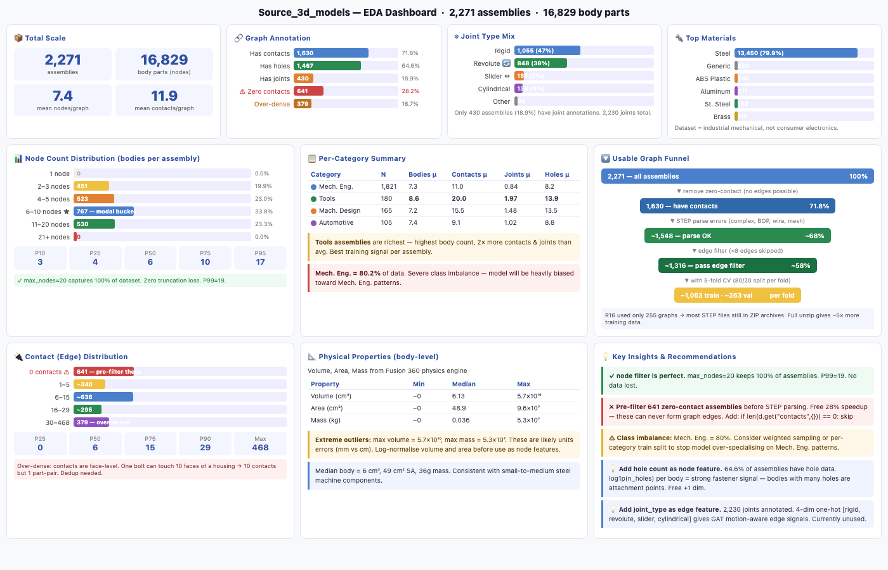
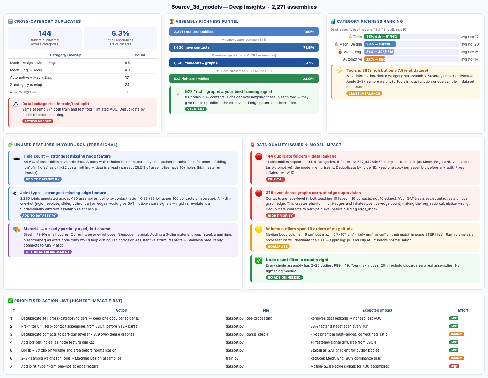
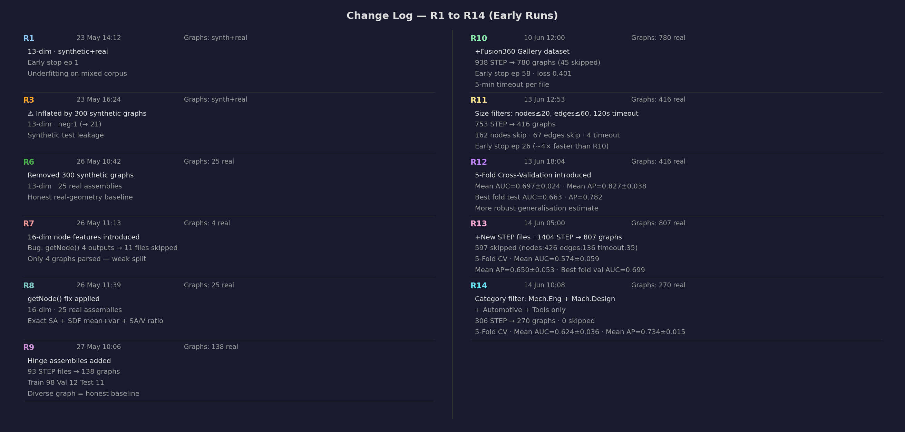
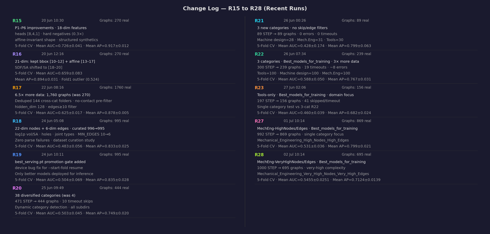

# AI-Assisted 3D Assembly Design

**Predicting Missing Components in CAD Assemblies using Graph Neural Networks**

| | |
|---|---|
| **Student** | Parthasarathy Perumal |
| **Programme** | M.Tech Data Science & AI, Sem 4 |
| **Guide (Phase 1)** | Prof. Sagarika Borah |
| **Guide (Phase 2)** | Prof. Gaurav Siwal |
| **University** | PES University, Electronic City, Bengaluru |
| **Phase 1** | May 10 – Jul 10, 2026 (Base replication) — **complete** |
| **Phase 2** | Jul 10 – Sep 10, 2026 (Novelty & improvement) — **in progress** |

---

## What's New (August 2026 — Phase 2/3)

- **Fixed under-detected/malformed fastener suggestions.** `surface_analyzer.py`'s free-surface detector was designed to find whole-face regions, not individual holes — an assembly with 8+4 real empty bolt holes had them all collapsed into a single whole-body region, so at most 1 ghost bolt/nut/washer mesh was ever generated, sized to the whole face instead of the hole. Added a parallel per-hole candidate path: gmsh's cylindrical-face type query + a diameter/depth plausibility filter + a pattern-repetition check (a real bolt-hole pattern repeats — 2+ same-diameter holes on a body; a one-off functional bore, like a central tool or shaft bore, doesn't and is correctly excluded). Verified on a real 12-hole test assembly: 12/12 holes now detected and correctly filled (was 1, malformed).
- **Decoupled fastener shape generation from the template's missing-count prediction** (`front_end/app.py`). `AssemblyTemplateDB`'s per-type count is only a category median from a small sample and was hard-capping generation — e.g. predicting 1 missing bolt for an assembly with 12 real empty holes whenever the template match was wrong or low-confidence. Generation is now driven directly by detected hole geometry + `PartBank`'s shape-fit score; the template match still drives the informational "Expected Components Missing" text panel for non-fastener types, just no longer gates the 3D ghost meshes.
- **Fixed a rod-vs-disk misclassification bug** in `rotate_to_target_axis()` (`shape_generator.py`) — comparing only the shortest-vs-longest extent can't distinguish a bolt's rod shape (`[5,5,20]`) from a washer's disk shape (`[5,20,20]`) when both hit the same extremes ratio, so bolts were aligning their *short* (diameter) axis to the joint instead of their long (shaft) axis. Fixed using the middle extent to tell rods from disks.
- **Added an absolute-size gate to the component-type classifier** (`max_fastener_extent` in `dataset.py`) — large multi-hole plates (e.g. a 150mm plate) were landing in the same relative-shape-ratio branch as small hex nuts/washers, since the classifier had no scale awareness at all. Corpus-wide audit confirmed the fix: Nut/Washer counts dropped ~10% each, redistributing correctly to Body/Thick Plate.
- **R34 — full corpus reprocess + retrain under the corrected classifier.** Phase 1: Mean AUC 0.5306→**0.5561** ± 0.0257, Mean AP 0.7213→**0.7422** ± 0.0146 (best fold val AUC 0.7364) — promoted to `checkpoints/best_serving.pt`; real evidence that mislabeled training data was hurting Phase 1. Phase 2 (NodeRanker) and Phase 3 (shape-gen VAE) both **regressed** on the mandatory re-sync retrain — Hit@1 0.3869→0.3261 (now *below* the 0.3406 majority-class baseline), shape-gen IoU 0.6113→0.5516, chamfer 0.0442→0.0778 — open question for follow-up, not yet root-caused.
- **Fixed a meshing-resilience gap in `part_bank.py`** — some STEP files have surfaces gmsh's mesher can't triangulate ("Impossible to mesh periodic surface"), which previously aborted extraction for the *whole* file instead of just that surface (mirrors a fix `dataset.py`'s `_parse_step` already had). Part bank grew from 3,221 → **4,500 parts** after the fix recovered previously-failed files.
- **Fixed two separate MPS memory leaks during retraining** — `train.py`'s fold-to-fold boundary and `train_shape_gen.py`'s per-sample training loop both accumulate MPS's per-tensor-shape compiled-graph cache with no eviction; left unmitigated, RSS ran away to 19–51GB and thrashed swap, collapsing epoch times from ~90s to 15+ minutes. Fixed with periodic `gc.collect()`/`torch.mps.empty_cache()` clearing (same pattern `train.py`'s within-epoch loop already used).
- **Migrated to the 8-class component taxonomy** (Long/Short Shaft, Thick/Thin Plate, Bolt, Washer, Nut, Body) — previously a candidate/audit-only scheme, now the *live* classifier used everywhere (`dataset.py`, `part_bank.py`, `app.py`'s single-body path). Replaces the old single-signal SDF rules (`fastener`/`bearing`/`shaft`/`plate`/`housing`/`gear`) with multi-signal voting (convex-hull ratio + ray-cast for through-holes, cylinder-fill + COM-offset + face-count for bolt heads). Triggered by a real bug: the old taxonomy's "bearing" class (1 example in the whole corpus) polluted a category's expected-components template and produced a spurious "1 bearing missing" report in the UI. `dataset.py` is now the single source of truth for `COMP_TYPES` and the classifier; `part_bank.py`, `app.py`, and `audit_component_types.py` import from it instead of duplicating.
- **R33 — full retrain under the new taxonomy** (5-fold CV, same 193-folder/7-category corpus) — Mean AUC 0.5306 ± 0.0314, Mean AP 0.7213 ± 0.0209. Manually promoted to `checkpoints/best_serving.pt` (R30 backed up to `archive_r30/`) since R30 and R33 encode node-feature type-slots under completely different taxonomies and aren't a valid apples-to-apples AUC comparison — the automatic promotion gate was deliberately overridden for this one case.
- **NodeRanker re-trained against R33** — Hit@1 0.3869, now **beating** the majority-class baseline (0.3650) — Hit@5 0.8467, MRR 0.5723, NDCG@5 0.6225. This resolves the prior below-baseline Hit@1 finding (0.2519 vs. baseline 0.5556 under the old taxonomy/R30).
- **Part bank rebuilt under the new taxonomy** — 3,221 parts from 284 assemblies (includes `rejected/`/`slow_or_unstable/` quarantine folders this pass), replacing the old 3,480-part/193-assembly bank built under the superseded taxonomy.
- **Shape-gen VAE re-trained against R33 + the rebuilt part bank** — Test IoU 0.5192, chamfer 0.0424, loss 0.4177 (best val IoU 0.4930 @ epoch 31) — both still comfortably beat the design targets (IoU ≥ 0.35, chamfer ≤ 0.08). Checkpoint: `checkpoints/shape_vae.pt`.
- **End-to-end verification on a real STEP file** — classification, `AssemblyTemplateDB` matching, and shape generation all confirmed producing new-taxonomy output (bolt/washer/nut/plate-style entries) with zero old-taxonomy categories remaining anywhere in the pipeline.
- **`assembly_templates.py`'s `_category_from_path()` bug fix** — previously assumed a fixed one-level nesting under `Source_3d_models/`, so every one of the 193 training assemblies resolved to the same bogus "category" (`best_models_for_training`), collapsing all 7 real categories into one blended template. Fixed to walk past known container directories; confirmed via a real Bench_Vice upload going from 10.4 % → 96.2 % template-match confidence after the fix + template rebuild.
- **Two multiprocessing timeout bugs fixed** in `dataset.py`/`part_bank.py`'s STEP-parsing timeout wrappers — an unconditional `p.join()` after `p.kill()` could block for minutes-to-tens-of-minutes when a child was stuck deep in an uninterruptible OpenCASCADE/gmsh C-extension call (SIGKILL doesn't guarantee instant death on macOS in that state); confirmed empirically via isolated testing. Fixed with bounded, wall-clock-deadline polling loops instead.

---

## Quick Start

```bash
# Clone and enter project
git clone <repo-url> && cd AI-Assisted-3D-Assembly-Design

# One command sets up everything
bash bootstrap.sh

# Add Gemini API key and review ports in .env
nano .env   # set GEMINI_API_KEY=... FRONTEND_PORT=... BACKEND_URL=...

# Activate environment
source .venv/bin/activate

# Start both services (reads ports from .env)
bash start_services.sh              # front-end :11501  · back-end :11000
bash stop_services.sh               # graceful shutdown

# Or run individually
streamlit run front_end/app.py      # 3D viewer only
cd back_end && python train.py      # GNN training
```

> Full setup guide → [`GETTING_STARTED.md`](./GETTING_STARTED.md)

---

## Abstract

Engineering CAD assemblies consist of multiple interconnected components whose correct selection is time-consuming and expertise-dependent. This project trains a **Graph Attention Network (GAT)** on assembly graphs to detect **missing components** via link prediction — Phase 1. A **Gemini-powered Skills AI agent** (AIDA) explains predictions in engineering language. An **Assembly Completeness Model** (`AssemblyTemplateDB`) learns per-category component-type distributions from training data and identifies what is missing when a partial or single-component file is uploaded. An **Octree-based Open Surface Detector** (inspired by the spatial partitioning technique in Borah & Borah 2020) identifies the precise mesh surfaces where missing components should be assembled, highlighting them in **lime green** directly on the 3D model — each open joint gets its own interactive legend entry. The solution is implemented entirely in Python using PyTorch Geometric, without dependency on proprietary CAD software APIs.

**Phase 2 (in progress):** heterogeneous relation-aware encoder (`RGATConv` + `TypedLinear`, deployed as R33 under the new 8-class component taxonomy) and next-component ranking via **NodeRanker** (cosine similarity, BPR loss, Hit@K / MRR / NDCG@K) — wired end-to-end into inference, API, and UI.

---

## Problem Statement

Modern CAD tools (SolidWorks, CATIA, Fusion 360) offer no contextual intelligence during assembly creation. Engineers rely entirely on domain knowledge to choose and position each component.

| Pain Point | Description |
|---|---|
| **Knowledge barrier** | Junior engineers lack assembly patterns built over years of experience |
| **No automation** | Existing CAD tools offer no intelligent part suggestion during assembly creation |
| **Non-standardisation** | Different designers make inconsistent choices for equivalent subassemblies |
| **Incomplete assemblies** | Partially defined assemblies have no mechanism to detect or fill missing parts |

**Research Gap:** No existing system applies graph-based deep learning to recommend components from partial CAD assembly graphs without proprietary API dependency.

---

## System Architecture

```
Source_3d_models/ (STEP files)
         │
         ▼
dataset.py — gmsh (OpenCASCADE)
  Solid bodies → Nodes · Shared surfaces → Edges (6-dim)
  + trimesh exact SA · SDF ray-casting (SDF mean + variance)
  Nodes: 22-dim · PyG InMemoryDataset
  Saves sources.json (source path per graph) alongside data.pt
         │
         ▼
model.py — AssemblyGNN (heterogeneous, 3-layer RGATConv + TypedLinear)
  22 → 128 → 64 dim · [8,4,1]-head relational attention over 4 joint types
  TypedLinear: per-component-type input/output projections (8 types)
  edge features on L1 · edge (relation) types on all 3 layers
         │
         ▼
LinkPredictor MLP  [Phase 1]
MLP(hᵤ‖hᵥ) → BCE
Missing component detection (AUC-ROC, AP)
         │
         ├──────────────────────────────────────────────────────┐
         ▼                                                       ▼
assembly_templates.py                               surface_analyzer.py
AssemblyTemplateDB                                  OctreeNode spatial partitioning
  • Groups training graphs by source folder           (Borah & Borah 2020 concept)
  • Computes median component-type counts           • After fragment(): free surfaces
    per category (hinge, shaft+bearing…)              (not shared between 2 bodies)
  • match() → assembly type + confidence            • Octree clusters nearby free
  • get_missing() → missing type list                 surface centroids into regions
  • Works for single-body uploads too               • Flags open mating joints
  • Cached to data/assembly_templates.json          • Returns triangle mesh per region
         │                                                       │
         └─────────────────────┬─────────────────────────────────┘
                               ▼
         ▼  (Phase 2 — implemented)
NodeRanker · cosine_sim(ctx, type prototypes) · BPR loss
Next-component ranking (Hit@K, MRR, NDCG@K)
Frozen-encoder head · own checkpoint node_ranker.pt
         │
         ▼
      skills_agent.py — Gemini AI (AIDA)
      Engineering explanation of predictions
                  │
                  ▼
         front_end/app.py — Streamlit
         Interactive 3D viewer + dual panel UI
         Left panel — 5 analysis sections:
           §0 Assembly type badge (purple)
           §1 Not assembled / under-connected (red) — deduplicated with ×N count badges
           §2 GNN missing links (blue) — deduplicated with ×N count badges
           §3 Auto-reference missing (orange)
           §4 Template missing components (teal)
           §5 Open surface joints (lime green)
         Right panel — 3D viewer (400 px, smooth shading, CharacteristicLengthMax=2.0):
           Red bodies = not assembled
           Orange ❓ = auto-reference missing
           Lime green ⬡ = open joints — one legend entry per joint, click to isolate
```

### Graph Schema

| Element | Dim | Features |
|---|---|---|
| **Node** | **22** | Type one-hot (8 classes, geometry-driven via SDF) · log1p volume · log1p exact SA (trimesh) · bbox Δx · bbox Δy · bbox Δz · elongation · flatness · aspect x/y · aspect y/z · sphericity · SDF mean · SDF variance · SA/V ratio · log1p hole count |
| **Edge** | **6** | Mate type encoded (coincident/concentric/parallel/tangent/fixed/other) · weight · joint-type one-hot (rigid/revolute/slider/cylindrical) |
| **Total assemblies** | 780 | 643 Fusion360 + 137 curated local |
| **Avg nodes/graph** | 31.8 (median 11) | Range: 2 – 448 |
| **Avg edges/graph** | 42.5 (median 12) | Range: 1 – 687 |
| **Train/Val/Test** | 70/15/15 | Split by assembly ID — no data leakage |

### Feature Engineering Detail (21 Node + 2 Edge Features — historical)

> **Note (Jul 2026):** this section documents the R16/R17-era 21+2 schema in detail. The
> current pipeline uses **22-dim nodes + 6-dim edges** (adds `log1p(n_holes)` node dim and a
> 4-dim joint-type one-hot on edges; volume/SA are `log1p`-clipped) — `back_end/config.yaml`
> and the docstring at the top of `back_end/dataset.py` are the authoritative reference.

The graph construction pipeline in `back_end/dataset.py` uses **gmsh + OpenCASCADE + trimesh + SDF ray-casting** to convert each STEP file into an attributed graph. Every solid body becomes a node; every detected physical contact becomes a bidirectional edge.

#### Node Features — 21 Dimensions

| Dim | Feature | Source | Status |
|---|---|---|---|
| [0–7] | Component type one-hot (8 classes) | SDF-inferred geometry rules | ✅ Geometry-driven (was hardcoded) |
| [8] | Normalised volume | `gmsh.occ.getMass()` | unchanged |
| [9] | **Exact** normalised surface area | `trimesh.Trimesh.area` | ✅ Exact (was bbox approximation) |
| [10] | **Bbox Δx** / bbox_max | `gmsh.occ.getBoundingBox()` | unchanged — absolute width |
| [11] | **Bbox Δy** / bbox_max | `gmsh.occ.getBoundingBox()` | unchanged — absolute height |
| [12] | **Bbox Δz** / bbox_max | `gmsh.occ.getBoundingBox()` | unchanged — absolute depth |
| [13] | **Elongation** — longest / mid axis | sorted bbox axes | ✅ New (R16) |
| [14] | **Flatness** — min / max axis | sorted bbox axes | ✅ New (R16) |
| [15] | **Aspect x/y** — dx/(dy+ε) normalised | `gmsh.occ.getBoundingBox()` | ✅ New (R16) |
| [16] | **Aspect y/z** — dy/(dz+ε) normalised | `gmsh.occ.getBoundingBox()` | ✅ New (R16) |
| [17] | **Sphericity** — π^⅓(6V)^⅔ / SA | gmsh + trimesh | ✅ New (R16) |
| [18] | **SDF mean** | Inward ray-casting (trimesh) | ✅ shifted from [15] |
| [19] | **SDF variance** | Inward ray-casting (trimesh) | ✅ shifted from [16] |
| [20] | **SA/V ratio** | exact_SA / volume | ✅ shifted from [17] |

**Dims [0–7] — Geometry-Driven Component Type One-Hot (8 classes)**

As of the August 2026 taxonomy migration, each body is classified by `dataset._classify_component_type()` using **multi-signal voting** (convex-hull ratio + central-axis ray-cast for through-holes, cylinder-fill + COM-offset + face-count for bolt heads) rather than the older single-signal SDF/bbox rules:

| Index | Class | Discriminating signal |
|---|---|---|
| 0 | `long_shaft` | Strong elongation (>5×), no through-hole |
| 1 | `short_shaft` | Elongated but below the long-shaft threshold, no through-hole |
| 2 | `thick_plate` | Flat (flatness ratio < 30 %), no through-hole, above thin-plate thickness cutoff |
| 3 | `thin_plate` | Flat and below the thin-plate thickness cutoff (< 8 % of max extent) |
| 4 | `bolt` | Elongated (2–8×) with hole vote + a distinct head (cylinder-fill/COM-offset/face-count vote) |
| 5 | `washer` | Flat, near-planar, high hole-vote confidence |
| 6 | `nut` | Compact, elongation < 1.8×, through-hole present, not flat |
| 7 | `body` | Generic fallback — none of the above vote strongly |

`_TYPE_THRESHOLDS` in `dataset.py` holds the exact cutoffs; a full-corpus audit (via `audit_component_types.py`) is the tool for re-tuning them against ground truth — the thresholds are carried over verbatim from the pre-migration candidate scheme and have **not** been re-validated post-migration (39.5 % of bodies showed vote conflicts in the last audit run).

**Dim [8] — Normalised Volume**

Exact B-Rep volume via `gmsh.model.occ.getMass(3, tag)`, normalised by the maximum across all bodies in the assembly.

**Dim [9] — Exact Normalised Surface Area**

Surface area is now computed from the actual triangulated mesh via `trimesh.Trimesh.area`, eliminating the bbox approximation (`2(dx·dy + dy·dz + dz·dx)`) that was the single biggest accuracy flaw in the 13-dim baseline.

$$\text{Feature}[9] = \frac{\text{trimesh.area}_i}{\max(\text{trimesh.area across all bodies})}$$

**Dims [10–12] — Normalised Bounding Box Dimensions (Δx, Δy, Δz)**

$$\text{Feature}[10] = \frac{dx_i}{\text{bbox}_\text{max}}, \quad \text{Feature}[11] = \frac{dy_i}{\text{bbox}_\text{max}}, \quad \text{Feature}[12] = \frac{dz_i}{\text{bbox}_\text{max}}$$

Unchanged — encode relative size and aspect ratio of each body.

**Dims [13–14] — Shape Diameter Function (SDF mean + variance)**

The **Shape Diameter Function** approximates CGAL's SDF algorithm via trimesh inward ray-casting:
1. Sample N surface points; shoot a ray along the *inward* surface normal for each
2. Record the first-hit distance (local thickness at that point)
3. Aggregate across all sampled points → mean (avg thickness) and variance (shape complexity)

| SDF signature | Inferred component role |
|---|---|
| High mean, low variance | Shaft — uniformly thick cross-section |
| Low mean, low variance | Plate — uniformly thin |
| High variance | Housing or gear — varying wall thickness |
| Std > 60 % of mean | Bearing — bimodal thick/thin ring regions |

Both values are normalised by the maximum within the assembly before use as features.

**Dim [15] — Normalised SA/V Ratio**

Surface-area-to-volume ratio is a powerful discriminator between shells and solids that neither SA nor volume alone provides:

$$\text{Feature}[15] = \frac{(\text{exact\_SA}_i / \text{Volume}_i)}{\max(\text{SA/V across all bodies})}$$

Flat plates and thin shells have high SA/V; compact solid blocks have low SA/V.

#### Edge Features — 2 Dimensions

Edges are bidirectional (each contact produces two directed edges, one in each direction). Both share the same attribute vector.

**Dim [0] — Normalised Mate Type**

Encodes the category of the physical constraint between two contacting bodies. The vocabulary is:

| Index | Mate Type | Normalised Value | Meaning |
|---|---|---|---|
| 0 | `coincident` | 0.0 | Face-to-face planar contact (default for all detected contacts) |
| 1 | `concentric` | 0.2 | Shared axis — shaft through bore, bearing in housing |
| 2 | `parallel` | 0.4 | Parallel faces without touching |
| 3 | `tangent` | 0.6 | Curved surface touching flat or curved surface |
| 4 | `fixed` | 0.8 | Rigid ground constraint |
| 5 | `other` | 1.0 | Fallback — used when graph is fully connected due to no detected contacts |

> **Current baseline limitation:** All detected contacts are hardcoded to `0.0` (coincident) and all fallback edges to `1.0` (other) — `dataset.py` lines 115 and 123. True mate constraint type (concentric vs tangent etc.) is not extractable from raw STEP geometry alone; it requires CAD assembly constraint metadata. This limitation is acknowledged and carried forward as-is.

**Dim [1] — Edge Weight (Contact Presence)**

A scalar set to `1.0` for all edges in the current implementation, indicating the presence of a detected or inferred connection. No partial contact weighting is applied in Phase 1.

#### Geometric Extraction Mechanism in gmsh

The contact detection pipeline relies on two key gmsh operations:

**Step 1 — Boolean Fragmentation**

```python
gmsh.model.occ.fragment(volumes, [])
```

By default, STEP bodies are independent solids with no shared topology. The `fragment()` operation performs a Boolean intersection of all volumes against each other, forcing bodies that are physically touching to share the *exact same* boundary surface tags. Without this step, no shared surfaces exist and no edges can be detected.

**Step 2 — Boundary Surface Extraction**

```python
bnd = gmsh.model.getBoundary([(dim, tag)], oriented=False, combined=True)
body_surfs.append(frozenset(abs(s[1]) for s in bnd if s[0] == 2))
```

For each body the 2D boundary surface tags are collected into a `frozenset`. An edge is then created between body $i$ and body $j$ whenever their surface sets intersect:

```python
if body_surfs[i] & body_surfs[j]:
    # physical contact detected → add bidirectional edge
```

**Step 3 — Area Threshold (Inference / App Only)**

In `front_end/app.py`, contact detection during inference applies an additional area threshold to filter out numerical overlaps from slightly misaligned parts:

```python
_shared_sa = sum(gmsh.model.occ.getMass(2, st) for st in shared_surfaces)
if _shared_sa / _min_body_sa >= 0.01:   # shared area ≥ 1% of smaller body
    # valid mate contact
```

This threshold is applied only in the Streamlit inference path (not during training), as the training STEP files are assumed to be geometrically clean assemblies.

---

## Codebase

```
AI-Assisted-3D-Assembly-Design/
│
├── bootstrap.sh                 ← One-shot automated setup (uv + venv + deps + .env)
├── start_services.sh            ← Start front-end + back-end; reads ports from .env
├── stop_services.sh             ← Graceful shutdown (SIGTERM → SIGKILL); reads ports from .env
├── GETTING_STARTED.md           ← Full setup and usage guide
├── .env.example                 ← Environment template (copy → .env)
│
├── front_end/
│   ├── app.py                   ← Streamlit 3D viewer (dual-panel, sidebar controls)
│   └── requirements.txt
│
├── back_end/
│   ├── config.yaml              ← All hyperparameters + data paths (authoritative for dims/config)
│   ├── dataset.py               ← STEP → PyG graph pipeline; 22-dim node / 6-dim edge features; saves sources.json
│   ├── model.py                 ← AssemblyGNN (RGATConv+TypedLinear) · LinkPredictor · NodeRanker
│   ├── train.py                 ← Phase 1 training loop · 5-fold CV · early stopping · serving-promotion gate · builds template DB
│   ├── train_ranker.py          ← Phase 2 NodeRanker training (frozen encoder, BPR, leave-one-node-out)
│   ├── part_bank.py             ← Phase 3: STEP → canonicalized/voxelized part bank (multiprocessing extraction)
│   ├── shape_generator.py       ← Phase 3: ConditionalShapeVAE + ShapeRetriever + HybridShapeGenerator
│   ├── train_shape_gen.py       ← Phase 3 VAE training (frozen encoder, leave-one-node-out, part-bank aligned)
│   ├── train_monitor.sh         ← Unattended-training watchdog: stall detection + auto-resume
│   ├── audit_component_types.py ← Read-only audit tool for the live 8-class taxonomy (threshold re-tuning aid)
│   ├── evaluate.py              ← AUC-ROC · AP · Hit@K · MRR · NDCG@K
│   ├── infer.py                 ← Inference on any STEP file or demo assembly (+ next-component ranking + shape generation)
│   ├── skills_agent.py          ← Gemini AI orchestrator with engineering skills
│   ├── assembly_templates.py    ← AssemblyTemplateDB: per-category component-type distributions
│   ├── surface_analyzer.py      ← OctreeNode + analyze_open_surfaces() — open joint detection
│   ├── requirements.txt
│   ├── data/                    ← Processed graph cache (auto-generated)
│   │   ├── processed/
│   │   │   ├── data.pt          ← Collated PyG graph bundle
│   │   │   └── sources.json     ← Source STEP path per graph (for template DB)
│   │   ├── part_bank/            ← Phase 3 part bank: index.json + per-part .npz voxel/mesh entries
│   │   └── assembly_templates.json  ← Template cache (built by train.py)
│   ├── checkpoints/             ← best_serving.pt (Phase 1) · node_ranker.pt (Phase 2) · shape_vae.pt (Phase 3)
│   └── results/                 ← train_log.json + test_metrics.json
│
├── skills/
│   └── engineering_3d_assembly.yaml  ← AIDA skills profile (6 domain skill areas)
│
├── trained_models/              ← Timestamped model exports (git-ignored *.pt, folder tracked)
│
└── Source_3d_models/            ← 3D assembly STEP files for training (git-ignored)
```

### Key files

| File | What it does |
|---|---|
| `back_end/dataset.py` | Scans `Source_3d_models/` for STEP files; UUID-named individual body STEPs filtered out; per-file 5-min timeout via `multiprocessing` spawn — timed-out folders moved to `skipped_models/` with JSON report; gmsh+OCC for solid bodies/edges; trimesh exact SA; SDF ray-casting; geometry-driven type inference; 16-dim node features; saves `sources.json` alongside `data.pt` for template DB |
| `back_end/model.py` | Heterogeneous 3-layer `RGATConv` encoder (22→128→64, 4 joint-type relations) wrapped in `TypedLinear` per-component-type projections; `LinkPredictor` MLP; `NodeRanker` (Phase 2 ranking head, active); `build_model()` returns `(gnn, lp, device)` |
| `back_end/train.py` | Training loop: BCE loss + hard negatives, Adam + ReduceLROnPlateau, early stopping; saves `best.pt` + timestamped export; calls `AssemblyTemplateDB.build()` after training to cache templates |
| `back_end/evaluate.py` | `evaluate()` returns AUC-ROC and Average Precision (Phase 1); Hit@K / MRR / NDCG@K (Phase 2, used by `train_ranker.py`) |
| `back_end/train_ranker.py` | Phase 2 NodeRanker training: leave-one-node-out task, BPR loss, frozen Phase 1 encoder — trains only the ranker projection; saves `checkpoints/node_ranker.pt` with encoder-staleness guard |
| `back_end/part_bank.py` | Phase 3 part bank builder: canonicalizes each body (center → OBB-align → unit-scale) → voxelizes to a 32³ occupancy grid (`skimage.measure.marching_cubes` for devoxelize); multiprocessing STEP extraction with a polling queue-drain (avoids the classic large-payload flush deadlock); `PartBank` class exposes `query()` (nearest-neighbour by type/category/bbox, with `exclude_assemblies` for leakage-safe eval) and `find_by_source()` (used by `train_shape_gen.py` to align part-bank entries to dataset graph nodes) |
| `back_end/shape_generator.py` | `ConditionalShapeVAE` (32³ occupancy 3D-CNN, 128-dim latent, 77-dim condition = 64-dim frozen-encoder context + 8-dim type one-hot + 3-dim target bbox + 2-dim neighbor scale); `ShapeRetriever` (part-bank nearest-neighbour + bbox refit); `HybridShapeGenerator` (retrieval-first, VAE fallback below `retrieval_tau`) |
| `back_end/train_shape_gen.py` | Phase 3 VAE training: leave-one-node-out samples aligned to part-bank entries via `find_by_source()`, 90°-rotation augmentation, BCE+soft-Dice+KL loss, voxel-IoU and voxel-centroid chamfer-proxy eval; saves `checkpoints/shape_vae.pt` |
| `back_end/audit_component_types.py` | Read-only corpus audit for the live 8-class taxonomy (Long/Short Shaft, Thick/Thin Plate, Bolt, Washer, Nut, Body) — imports `COMP_TYPES`/classifier from `dataset.py` (single source of truth); writes `audit_classification.{json,html}` to the corpus root; useful for re-tuning `_TYPE_THRESHOLDS` against ground truth |
| `back_end/infer.py` | `predict_missing()` scores all absent node pairs and returns top-K with confidence; `predict_next_component()` (Phase 2 ranking); `load_shape_generator()`/`generate_missing_shape()` (Phase 3 — dispatches `HybridShapeGenerator` off the top-ranked NodeRanker prediction); bar-chart CLI output |
| `back_end/skills_agent.py` | `AssemblySkillsAgent` — loads skills YAML, builds Gemini system prompt, exposes `explain_prediction()`, `identify_component()`, `suggest_assembly_sequence()`, `answer()` |
| `back_end/assembly_templates.py` | `AssemblyTemplateDB` — loads `data.pt` + `sources.json`, groups graphs by assembly category (top-level folder under `Source_3d_models/`), computes median component-type counts per category; `match()` returns best assembly type + confidence; `get_missing()` returns missing component list; handles single-body uploads |
| `back_end/surface_analyzer.py` | `OctreeNode` — lightweight 3-D octree for spatial grouping of surface centroids (adapted from Borah & Borah 2020 block decomposition). `analyze_open_surfaces()` — after boolean fragment(), identifies free surfaces (unmated) above area threshold, clusters them via Octree, extracts triangle mesh per region (handles type-2 and type-9 elements; `_synthetic_surface_mesh()` fallback guarantees a visible patch); returns open joint records for lime-green 3D overlay |
| `front_end/app.py` | Streamlit app — dual panels (both 400 px); 6-section left inference panel (assembly type, not-assembled with ×N dedup, GNN links with ×N dedup, auto-reference missing, template missing, open surface joints); 3D viewer with red/orange/lime-green overlays, smooth Phong shading, CharacteristicLengthMax=2.0; AIDA 4-section structured explanation with line-by-line HTML renderer |

---

## Skills AI (AIDA)

The project uses **Google Gemini** as an AI orchestrator configured with mechanical engineering domain knowledge.

### Pipeline

```
GNN predictions + node_degrees + open_surfaces (all three categories)
         │
         ▼
AssemblySkillsAgent  ←  skills/engineering_3d_assembly.yaml
         │                (persona + 6 skill domains + response rules)
         ▼
Gemini (gemini-2.0-flash)  [max_output_tokens=2500]
         │
         ▼
Structured 4-section explanation displayed in AIDA panel:
  === 1. Not Assembled / Not Properly Mated ===
  === 2. AI Predicted Missing Links ===
  === 3. Open Assembly Joints Detected ===
  === Overall Recommendation ===
```

### Skill domains

| Skill | Coverage |
|---|---|
| `mechanical_engineering` | Statics, materials, tolerancing (GD&T), design for manufacturing |
| `3d_modelling` | B-Rep, STEP/IGES, OpenCASCADE, solid modelling kernels |
| `3d_assembly_design` | Mate constraints, DOF, assembly hierarchies, sub-assemblies |
| `3d_parts_identification` | Body / fastener / bearing / shaft / plate / gear classification from geometry |
| `gnn_interpretation` | Reading AUC-ROC, AP, link confidence scores in engineering terms |
| `assembly_sequencing` | Build order, fixture requirements, interference analysis |

### Usage

```python
from back_end.skills_agent import AssemblySkillsAgent

agent = AssemblySkillsAgent()
print(agent.explain_prediction(
    missing=[((2, 5), 0.87), ((0, 3), 0.72)],
    recs=[],   # next-component recs added in Phase 2
    context="Lathe tailstock — 4 known components",
))
```

Set `GEMINI_API_KEY` in `.env`. The agent degrades gracefully (offline mode) without a key.

AIDA now produces a **structured 4-section response** covering all three analysis categories and an overall engineering recommendation. The prompt passes compact summaries of all three data categories (not-mated nodes grouped by unique name with counts, predicted links, open joint bodies) and explicitly instructs the model to complete all four sections with at most 3 bullets per section.

**AIDA panel rendering:** The response is parsed line-by-line into styled HTML — section headings (`=== … ===`) render in sky-blue bold, bullet lines (`*`, `-`) in bright white, and plain text in the same bright colour — so all four sections are fully legible on the dark blue gradient background. `html.escape()` is applied before injection to prevent special characters in the Gemini output from breaking the HTML structure.

---

## Environment Configuration (.env)

Copy `.env.example` → `.env` and fill in your values. Key sections:

| Section | Key variables |
|---|---|
| **Google Gemini** | `GEMINI_API_KEY` · `GEMINI_MODEL=gemini-2.0-flash` |
| **Skills AI** | `SKILLS_PROFILE=engineering_3d_assembly` · `SKILLS_TEMPERATURE=0.3` |
| **Frontend** | `FRONTEND_HOST=localhost` · `FRONTEND_PORT=11501` |
| **Backend** | `BACKEND_URL=http://localhost:11000` |
| **LLM** | *(placeholder for future LLM-specific keys)* |
| **Application** | `APP_ENV=development` · `LOG_LEVEL=INFO` · `SOURCE_3D_MODELS=<path>` |

`start_services.sh` and `stop_services.sh` both read `FRONTEND_PORT` and `BACKEND_URL` from `.env` automatically — no need to edit the scripts when changing ports.

---

## 3D Viewer (Front-end)

**Stack:** STEP → gmsh (OpenCASCADE) → STL → PyVista → Plotly `Mesh3d` → Streamlit

```bash
source .venv/bin/activate
bash start_services.sh          # starts Streamlit on FRONTEND_PORT (default 11501)
# or directly:
streamlit run front_end/app.py --server.port 11501
```

**Dual-panel layout:**

| Panel | Description |
|---|---|
| **Left — AI-Assisted Viewer** | Shows "Train first" if no checkpoint. After training: upload a STEP file → runs GNN inference → displays 5 stacked analysis sections (see below). |
| **Right — 3D Model Viewer** | Upload any STEP/STP file → gmsh converts → interactive Plotly 3D viewer. Bodies highlighted in red (not assembled), orange ❓ cross markers (auto-reference missing), amber ⬡ mesh patches (open joints). |

**After training completes** a green banner appears: *"🎉 Training Complete · AUC X.XXXX · AP X.XXXX — Model ready!"*. A persistent **model metrics badge** (AUC-ROC + Avg Precision) is shown at the top of the left inference panel, colour-coded green (≥ 0.70) / amber (≥ 0.55) / red (< 0.55).

### Left Inference Panel — Analysis Sections

The left panel height is **400 px** (matching the 3D viewer) with `overflow-y: auto` scroll.

| Section | Colour | What it shows |
|---|---|---|
| **§0 Assembly Type Identified** | Purple `#a78bfa` | Assembly category (e.g. "Hinge Assembly") with a % confidence badge and training sample count |
| **§1 Not Assembled / Not Properly Mated** | Red `#ef4444` | Bodies with degree = 0 (no contacts) or under-connected vs. their group average. **Deduplicated** — repeated instances grouped into one row with a red ×N count badge |
| **§2 AI Predicted Missing Links** | Blue `#5b9bd5` | GNN-predicted missing edges with confidence bars (hidden for single-body uploads). **Deduplicated** — same-named pairs merged with a blue ×N count badge showing highest confidence |
| **§3 Potentially Missing Components** | Orange `#f97316` | Components found in the matched reference assembly but absent in the upload |
| **§4 Expected Components Missing** | Teal `#14b8a6` | Template-DB difference: component types expected by the assembly category but not present |
| **§5 Open Assembly Joints Detected** | Lime green `#84cc16` | Specific body indices and surface area percentages flagged as open mating joints by the Octree analyser. Each entry has a lime-green square swatch. Hint: *"click a legend entry in the 3D viewer to isolate each joint"* |

### 3D Viewer Overlay Colours

| Colour | Symbol | Meaning |
|---|---|---|
| Red `#ff4d4d` | Solid body | Not assembled or under-connected (§1) |
| Orange `#f97316` | ❓ Cross marker | Auto-reference missing component — estimated position |
| Lime green `#84cc16` | ⬡ Mesh patch | Open mating joint surface — "This area needs components to be assembled"; one labelled legend entry per joint (e.g. `⬡ Body 26 (43%)`); click legend to isolate |

### 3D Viewer Quality

| Setting | Value | Effect |
|---|---|---|
| `CharacteristicLengthMax` | 2.0 (was 5.0) | ~6× denser mesh — curved surfaces are smooth |
| `Mesh.Optimize` | on | Better triangle aspect ratios |
| `flatshading` | `False` | Phong smooth shading — no hard facet edges |
| Lighting | ambient 0.6 / diffuse 0.9 / specular 0.5 | Sharper highlights and depth |
| Viewer height | 400 px (was 255 px) | 57 % larger canvas |

### Single-Body Upload Behaviour

Uploading a single-part STEP file (which previously returned an error) now triggers a full geometry analysis:

1. Component type inferred from SDF statistics + bounding-box ratios
2. Template DB matched against that single type → assembly type identification
3. Template missing components listed (what else the assembly needs)
4. Open surface analyser flags which faces of the single body are the expected mating joints
5. AIDA explanation skipped (no GNN inference possible with 1 body)

### Assembly Health Detection

The inference pipeline analyses every component in the uploaded STEP file and flags assembly problems in the left panel and 3D viewer (red highlight):

| Condition | Detection Method |
|---|---|
| **Not Assembled** | Degree = 0 after area-thresholded contact check — no surface contact with any other part |
| **Under-Connected** | Same part (by name) appears multiple times; instances with fewer connections than the best-connected instance are flagged |

**Area-threshold contact rule:** A shared surface between two bodies only counts as a mate connection when the shared area is ≥ 1 % of the smaller body's total surface area. This filters incidental tiny overlaps from slightly-displaced parts that are not truly mated.

**Group-based under-connection:** Parts are grouped by their **basename** (last path segment in the STEP hierarchy, e.g. `11-Black Dice LicPlate Bolts-X4`) regardless of instance folder. If one bolt is correctly mated and three others are displaced, the three displaced bolts are flagged as under-connected.

### Part Name Display

Component names are extracted from gmsh entity names (STEP path hierarchy) and displayed as short labels:

- Full gmsh paths like `Shapes/Assembly/InstanceFolder/PartName` are trimmed to the last segment
- Names are inherited through the `fragment()` operation so sub-volumes created by Boolean splitting retain their parent's name
- Any remaining unnamed nodes are filled from STEP `PRODUCT` records as fallback

**Sidebar layout:**

| Row | Controls |
|---|---|
| 1 | Colour · Opacity (side by side) |
| 2 | Background · Camera (side by side) |
| 3 | *(note)* Locate source for training |
| 4 | **📁 3D Files** — native macOS folder picker; saves to `.env` + `config.yaml` |
| 5 | *(label)* 📂 If new 3D models added |
| 6 | **🔄 Upload new file** *(when left viewer has a file)* |
| 7 | **🚀 Train 3D Models** — starts `back_end/train.py` with unbuffered stdout; milestones stream live to Activity Log every 3 s |
| 8 | **📋 Activity Log** — colour-coded per stage; shows dataset parsing, model build, every 10th epoch AUC, test results |

**Training Activity Log stages:**

| Emoji | What it shows |
|---|---|
| 📂 | `[1/4] Loading dataset` |
| 🗂️ | STEP files found / parsed / synthetic graphs generated |
| 🧠 | `[2/4] Building model` · params count |
| 🏋️ | `[3/4] Training` |
| 📊 | Epoch 10, 20 … with AUC score |
| ✅ | New best AUC checkpoint saved |
| 📈 | `[4/4] Test results` — final AUC / AP |
| ✅ | Training complete + prompt to upload for prediction |

---

## Backend — GNN Training

```bash
cd back_end

# From the UI: click "🚀 Train 3D Models" in the sidebar — streams milestones to Activity Log

# Or from the terminal:
python train.py                        # reads Source_3d_models/ by default
python train.py --force-reload         # re-process STEP files (clears graph cache)

# Inference demo
python infer.py --demo
python infer.py --step ../Source_3d_models/my_assembly.step

# Test the Skills AI agent
python skills_agent.py
```

### Training configuration (`config.yaml`)

| Parameter | Value |
|---|---|
| Encoder layers | 3 × `RGATConv` (22→128→64 dim, 4 joint-type relations) + `TypedLinear` in/out (8 component types) |
| Attention heads | [8, 4, 1] |
| Dropout | 0.2 |
| Optimizer | Adam lr=1e-3, weight_decay=5e-4 |
| LR schedule | ReduceLROnPlateau (factor=0.5, patience=8) |
| Early stopping | patience=20 |
| Max epochs | 200 |
| Batch size | 16 graphs (reduced from 32 in R31 — MPS out-of-memory mitigation on Apple Silicon) |
| Neg sampling ratio | 0.5 per positive (+ hard negatives weighted 0.3×) |
| Cross-validation | 5-fold, per-batch heartbeat logging (stall-detector compatibility) |
| Ranker (Phase 2) | 30 epochs · lr 1e-3 · `n_per_graph` 5 leave-one-node-out samples · BPR loss |
| Shape-gen VAE (Phase 3) | 60 epochs · lr 1e-3 · `n_per_graph` 8 · voxel res 32³ · latent 128 · cond 77-dim · β_KL 0.05 · λ_dice 0.5 · `retrieval_tau` 0.6 |

### Trained model output

After training completes a timestamped file is saved to `trained_models/`:

```
trained_models/assembly_gnn_20260809_114805_auc07364.pt   ← R34 (22+6-dim, same 8-class taxonomy, `max_fastener_extent` absolute-size classifier fix — stops large multi-hole plates misclassifying as nut/washer — full 193-folder corpus reprocessed under the corrected classifier, best fold val AUC 0.7364, mean AUC 0.5561±0.0257, mean AP 0.7422±0.0146, 2026-08-09) — serving promoted ★ CURRENT (beats R33 on both metrics, automatic gate)
trained_models/assembly_gnn_20260806_104442_auc06367.pt   ← R33 (22+6-dim, new 8-class taxonomy — long/short shaft, thick/thin plate, bolt, washer, nut, body — heterogeneous RGATConv+TypedLinear, same 193-folder/7-category corpus re-parsed under new taxonomy, best fold val AUC 0.6367, mean AUC 0.5306±0.0314, mean AP 0.7213±0.0209, 2026-08-06) — superseded by R34 (manually overridden gate at the time — R30/R33 taxonomies aren't AUC-comparable)
trained_models/assembly_gnn_20260731_*_auc06670.pt        ← R32 (22+6-dim, heterogeneous RGATConv+TypedLinear, 193-folder 7-category corpus post category-filter bugfix, best fold val AUC 0.6670, mean AUC 0.5067±0.0524, mean AP 0.7054±0.0265, final test AUC 0.4875/AP 0.6873, 2026-07-31/08-01) — serving NOT promoted (R30 better on both, old taxonomy)
trained_models/assembly_gnn_20260721_103045_auc06368.pt   ← R31 (22+6-dim, heterogeneous RGATConv+TypedLinear, 484-graph expanded corpus, best fold val AUC 0.6368, mean AUC 0.5940, mean AP 0.7617, 2026-07-21) — serving NOT promoted (R30 better on both, old taxonomy)
trained_models/assembly_gnn_20260719_213012_auc07070.pt   ← R30 (22+6-dim, heterogeneous RGATConv+TypedLinear — first hetero run, 248 graphs, best fold val AUC 0.7070, mean AUC 0.599, mean AP 0.869, 2026-07-19) — superseded by R33 (old taxonomy); backed up at `checkpoints/archive_r30/`
trained_models/assembly_gnn_20260719_065811_auc07041.pt   ← R29 (22+6-dim, homogeneous GAT, new 8-category corpus, 248 graphs, best fold val AUC 0.7041, mean AUC 0.566, mean AP 0.843, 2026-07-19) — serving promoted
trained_models/assembly_gnn_20260702_101436_auc05783.pt   ← R28 (22+6-dim, MechEng-VeryHighNodes/Edges, Best_models_for_training, 1000 STEP → 695 graphs, best fold val AUC 0.5783, mean AUC 0.5455, mean AP 0.7124, 2026-07-02) — serving promoted
trained_models/assembly_gnn_20260701_101409_auc06769.pt   ← R27 (22+6-dim, MechEng-HighNodes/Edges, Best_models_for_training, 992 STEP → 869 graphs, best fold val AUC 0.6769, mean AUC 0.531, mean AP 0.799, 2026-07-01) — serving promoted
trained_models/assembly_gnn_20260627_020624_auc07100.pt   ← R23 (22+6-dim, Tools-only, Best_models_for_training, 156 graphs, best fold val AUC 0.710, mean AUC 0.460, mean AP 0.682, 2026-06-27) — serving promoted (first on branch)
trained_models/assembly_gnn_20260626_073453_auc06246.pt   ← R22 (22+6-dim, 3 categories, Best_models_for_training, 239 graphs, best fold val AUC 0.625, mean AUC 0.588, mean AP 0.767, 2026-06-26) — serving promoted
trained_models/assembly_gnn_20260626_003859_auc07308.pt   ← R21 (22+6-dim, 3 new categories, 89 graphs, best fold val AUC 0.731, mean AUC 0.428, mean AP 0.799, 2026-06-26) — serving promoted
trained_models/assembly_gnn_20260625_094934_auc06267.pt   ← R20 (22+6-dim, 38 categories, 444 diversified graphs, best fold val AUC 0.627, mean AUC 0.503, mean AP 0.749, 2026-06-25) — serving NOT promoted
trained_models/assembly_gnn_20260624_101135_auc06409.pt   ← R19 (22-dim+6-dim edges, 995 curated graphs, best fold val AUC 0.641, mean AUC 0.504, mean AP 0.835, 2026-06-24)
trained_models/assembly_gnn_20260624_050811_auc06284.pt   ← R18 (22-dim+6-dim edges, 995 curated graphs, best fold val AUC 0.628, mean AUC 0.483, mean AP 0.833)
trained_models/assembly_gnn_20260622_081627_auc07117.pt   ← R17 (21-dim, 1760 graphs, hidden_dim 128, best fold val AUC 0.712, mean AUC 0.625)
trained_models/assembly_gnn_20260620_121621_auc09018.pt   ← R16 (21-dim, bbox+affine features, 270 graphs, best fold val AUC 0.902, mean AUC 0.659)
trained_models/assembly_gnn_20260620_103030_auc09018.pt   ← R15 (18-dim, P1–P6, heads [8,4,1], hard negatives, 270 graphs, best fold val AUC 0.902, mean AUC 0.726)
trained_models/assembly_gnn_20260614_100837_auc07152.pt   ← R14 (category filter, 270 graphs, best fold val AUC 0.715, mean AUC 0.624)
trained_models/assembly_gnn_20260614_050047_auc06985.pt   ← R13 (5-fold CV, 807 graphs, best fold val AUC 0.699, mean AUC 0.574)
trained_models/assembly_gnn_20260613_180449_auc06591.pt   ← R12 (5-fold CV, 416 graphs, best fold val AUC 0.659, mean AUC 0.697)
trained_models/assembly_gnn_20260613_125353_auc07809.pt   ← R11 (16-dim, 416 graphs, size-filtered, val AUC 0.781)
trained_models/assembly_gnn_20260610_120044_auc05943.pt   ← R10 (16-dim, 780 graphs, Fusion360 full, test AUC 0.604)
```

Each export contains: epoch · best AUC · test metrics · `trained_at` timestamp · `source_dir` path · model weights (`gnn`, `lp`) · full config. Files are git-ignored; the folder is tracked.

### Phase 1 targets — Missing Component Detection

| Metric | Target |
|---|---|
| AUC-ROC | ≥ 0.85 |
| Average Precision | ≥ 0.82 |

> Current status (Aug 2026): serving model is **R34** — mean AUC 0.5561 ± 0.0257, mean AP 0.7422 ± 0.0146
> (best fold val AUC 0.7364), trained under the corrected classifier (`max_fastener_extent` absolute-size
> gate, see *What's New*) on the same 8-class taxonomy. Promoted automatically — beats R33 (0.5306/0.7213)
> on both metrics, with lower variance too. AP target still open; AUC target still open. This is real
> evidence the classifier's large-multi-hole-plate-as-nut bug was hurting Phase 1 training data quality,
> though the AUC is still fairly close to random — narrowing the gap, not closing it. Historical R30-era
> commentary below is preserved for the training-history narrative but no longer describes the serving model.

### Phase 2 targets — Next-Component Ranking (NodeRanker)

| Metric | Target | R33 run (Aug 2026) | R34 run (Aug 2026) |
|---|---|---|---|
| Hit@5 | ≥ 0.70 | 0.8467 ✓ | 0.7681 ✓ |
| MRR | ≥ 0.64 | 0.5723 | 0.5264 |
| Hit@1 | — | 0.3869 (beat 0.3650 baseline) | **0.3261 (below 0.3406 baseline)** |
| NDCG@5 | — | 0.6225 | 0.5606 |

> Retrained against R34's encoder + corrected classifier (mandatory whenever `best_serving.pt` is
> re-promoted — the ranker's cosine-similarity space must stay in sync with the frozen encoder it's
> built on). Result is a **regression**, not an improvement: Hit@1 fell back below the majority-class
> baseline, undoing the R33-era fix. Plausible cause: the corrected classifier rebalanced the type
> distribution (less nut/washer, more body/thick_plate), making the 8-way ranking task intrinsically
> harder and less skewed toward types the old (mislabeled) data over-represented — the fixed 30-epoch
> budget may not be enough to adapt. Not yet root-caused; flagged as open follow-up work.

### Phase 3 targets — Missing-Component Shape Generation

| Metric | Target | R33 run (Aug 2026) | R34 run (Aug 2026) |
|---|---|---|---|
| Voxel IoU | ≥ 0.35 | 0.5192 ✓ | 0.5516 ✓ |
| Chamfer (voxel-centroid proxy) | ≤ 0.08 | 0.0424 ✓ | 0.0778 |
| Loss (BCE + soft-Dice + KL) | — | 0.4177 | 0.3214 |

> `ConditionalShapeVAE` retrained 60 epochs against the R34 encoder and the rebuilt 4,500-part bank
> (up from 3,221 after the `part_bank.py` meshing-resilience fix, see *What's New*). Note this run is
> **not directly comparable** to the R33 row above it — mid-session the shape-gen training target was
> additionally narrowed to fasteners only (bolt/nut/washer), with continuous-rotation augmentation and
> the 18 zero-fastener corpus folders excluded from training samples; the immediately-prior fastener-only
> baseline (before the classifier fix) was IoU 0.6113 / chamfer 0.0442, and R34 is a **regression**
> against *that* number specifically (IoU -9.8%, chamfer +76% worse) — likely from the larger, more
> varied part bank now including geometry recovered from previously-failing files, some of it more
> fragmented. Both design targets are still met in absolute terms; not yet root-caused, flagged as open
> follow-up work alongside the Phase 2 regression above.

---

## Datasets

### Current training corpus (Jul 28 – Aug 1, 2026 overhaul)

`Source_3d_models/Best_models_for_training/` is a clean, fully-verified corpus of
**7 real-world assembly categories**, expanded from the original 3 (Bench_Vice/C_Clamps/
Pipe_Vice) with 4 more (Gate_Valve/Press_Tool/Tool_Post/Crane_hook) and re-audited for
parsability:

| Category | Usable folders |
|---|---|
| Bench_vice | 54 |
| Pipe_vice | 42 |
| C_Clamps | 31 |
| Gate_Valve | 21 |
| Press_Tool | 21 |
| Crane_hook | 16 |
| Tool_Post | 8 |
| **Total** | **193** |

- Every folder follows a uniform layout: `<Category>_NN/<Category>_NN.step` (exactly one
  STEP file, renamed to match the folder) + `Images/` (renders). Original folder names are
  preserved in `rename_mapping.json`.
- Only `.stp`/`.step` + image formats retained; all proprietary CAD formats
  (SLDPRT/CATPart/IPT/PRT/F3D/…) were removed. Folders without STEP moved to
  `non_compatible_formats/`; folders whose STEP parses to <2 solid bodies (single-body
  exports — unusable for link prediction) moved to `rejected/`; a second parsability audit
  quarantined 22 TIMEOUT + 3 ERROR folders into `slow_or_unstable/` (same convention as
  `rejected/`/`non_compatible_formats/`, one level under each category).
- `config.yaml`'s `data.categories` and `train.py`'s `CATEGORY_WEIGHTS` have been updated
  to this 7-category/193-folder corpus (R32 onward). `dataset.py`'s category filter was
  also fixed in this pass — it previously matched on `any(part in categories for part in
  path.parts)`, which would have silently pulled files from `rejected/`/
  `non_compatible_formats/`/`slow_or_unstable/` back into training since they mirror
  category names one level down; it now checks only the top-level folder under
  `source_dir`.
- Browse the corpus visually: `Best_models_for_training/gallery.html` (thumbnail gallery)
  and `audit_classification.html` (per-body component-type audit).

The table below records the full dataset lineage across Phase 1 (historical):

| Dataset | Size | Role |
|---|---|---|
| [ABC Dataset](https://deep-geometry.github.io/abc-dataset/) — Koch et al., CVPR 2019 | 1M+ STEP / B-Rep files | Primary training data; geometric metadata (bbox, volume, surface area, mate constraints) |
| [Fusion 360 Gallery](https://github.com/AutodeskAILab/Fusion360GalleryDataset) — Willis et al., 2021 | 8,251 assemblies · 154K bodies | **Integrated (Jun 2026)** — 751 `assembly.step` files extracted from `a1.0.0_00.7z`; UUID-named individual body STEPs filtered; 643 assemblies parsed successfully (45 timed-out and quarantined, 63 single-body/invalid) |
| [PartNet](https://partnet.cs.stanford.edu/) — Mo et al., CVPR 2019 | 573,585 parts · 26 categories | Hierarchical part annotations for edge feature construction |
| Local assemblies (`Source_3d_models/`) | 187 STEP files → 137 graphs | `Assembly_Files/` · `Bracket_Bolt/` · `Shaft_Bearing_Housing/` · `Hinge_assembly/` · `Plate_Bolt/` |
| **Total training graphs** | **780** | 643 Fusion360 + 137 curated local; 24,811 total nodes · 33,166 total edges |
| Synthetic (fallback) | ~~300 graphs~~ **removed** | Synthetic fallback removed; training raises an error if no real multi-body STEP files are found |

### Dataset Insights — R10 Training Set (780 assemblies)

> Statistics computed from `data.pt` + `sources.json` after Fusion360 integration (10 Jun 2026).

#### Graph Size Distribution

| Metric | Nodes (bodies/graph) | Edges (contacts/graph) |
|---|---|---|
| **Minimum** | 2 | 1 |
| **Maximum** | 448 | 687 |
| **Mean** | 31.8 | 42.5 |
| **Median** | 11 | 12 |
| **Total (all graphs)** | 24,811 | 33,166 |

#### Assembly Size Buckets

| Size class | Bodies per assembly | Count | % of dataset |
|---|---|---|---|
| **Small** | 2 – 5 | 270 | 34.6 % |
| **Medium** | 6 – 20 | 244 | 31.3 % |
| **Large** | 21 – 50 | 140 | 17.9 % |
| **Extra-large** | > 50 | 126 | 16.2 % |

The long tail of extra-large assemblies (up to 448 bodies) comes predominantly from Fusion360 industrial models.

#### Source Breakdown

| Source | Assemblies | Notes |
|---|---|---|
| Fusion360 Gallery (a1.0.0_00) | 643 | Extracted from 751 STEP files; 45 quarantined (>5 min timeout), 63 single-body/invalid |
| Local curated (`Source_3d_models/`) | 137 | Assembly_Files, Bracket_Bolt, Shaft_Bearing_Housing, Hinge_assembly, Plate_Bolt |

#### Template Categories Built (6 categories from 780 assemblies)

| Category | Avg bodies | Dominant types |
|---|---|---|
| Mechanical Assembly | ~51 | body 30, fastener 14, plate 14 |
| Bracket + Bolt Assembly | ~12 | body 8, fastener 4, plate 4 |
| Fusion360 Assy Dataset | ~14 | body 9, fastener 6, bearing 1, plate 4, housing 1 |
| Hinge Assembly | ~3 | body 2, fastener 1, plate 1 |
| Plate + Bolt Assembly | ~21 | body 14, fastener 4, plate 3 |
| Shaft + Bearing + Housing Assembly | ~10 | body 7, fastener 4, plate 1, housing 1 |

### Visual EDA — Source_3d_models (2,271 assemblies · 16,829 body parts)

> Interactive dashboards: [`docs/source_3d_models_eda.html`](./docs/source_3d_models_eda.html) · [`docs/eda_insights_deep.html`](./docs/eda_insights_deep.html)

#### EDA Dashboard

2,271 assemblies with 16,829 body parts across 4 categories. KPIs, node/edge distributions, per-category breakdown, joint types, materials, physical properties, usable graph funnel, and key recommendations.



**Key findings:** Modal bucket is 6–10 nodes/assembly (33.8%). `max_nodes=20` captures 100% of assemblies (P99=19). 641 assemblies (28.2%) have zero contacts and should be pre-filtered. Tools category is richest (8.6 avg bodies, 20 avg contacts) but only 7.9% of data. Mech. Eng. dominates at 80.2%. Steel = 79.9% of all body materials. Volume outliers span 10 orders of magnitude (unit mismatches).

#### Deep Insights — Data Quality, Richness & Unused Features

Cross-category duplicates, assembly richness funnel, category ranking, unused feature opportunities (holes, joint types, materials), data quality issues, and prioritised action list.



**Critical findings:**

- **144 cross-category duplicates** (6.3% of assemblies) caused data leakage risk — now deduplicated (✅ Done)
- **522 "rich" assemblies** (nb ≥ 8, nc ≥ 10) = 23% of dataset — best training signal; consider oversampling
- **379 over-dense graphs** have face-level contacts (1 bolt touching 10 faces = 10 contacts) — need part-pair deduplication
- **Hole count** (64.6% coverage) and **joint type** (2,230 annotations) are free unused features in the JSON metadata

#### Prioritised Action List

| # | Action | Impact | Effort | Status |
|---|---|---|---|---|
| 1 | Deduplicate 144 cross-category folders | Removes data leakage → honest Test AUC | Low | ✅ Done |
| 2 | Pre-filter 641 zero-contact assemblies before STEP parse | 28% faster dataset scan | Low | Planned |
| 3 | Deduplicate contacts to part-pair level (fix 379 over-dense) | Fixes phantom multi-edges, correct neg_ratio | Medium | Planned |
| 4 | Add `log1p(n_holes)` as node feature dim-22 | +1 fastener-signal dim, free from JSON | Low | Planned |
| 5 | `log1p` + 3σ clip on volume and area before normalisation | Stabilises GAT gradient for outlier bodies | Low | Planned |
| 6 | 2–3× sample weight for Tools + Machine Design assemblies | Reduces Mech. Eng. 80% dominance bias | Medium | Planned |
| 7 | Add `joint_type` 4-dim one-hot as edge feature | Motion-aware edge signals for 430 assemblies | High | Planned |

---

#### Dataset Processing — Size Filters & Skip Policy (R11 onwards)

Three automatic filters prevent large assemblies from blocking training on M1. Each filter moves the offending folder to a dedicated subdirectory and writes an entry to `skipped_models_report.json`:

| Filter | Threshold | Folder | Rationale |
|---|---|---|---|
| **Node count** | > 20 bodies | `skipped_models/nodes_gt_20/` | 74% of Fusion360 assemblies pass; >20 bodies slow gmsh fragment() significantly |
| **Edge count** | > 60 directed edges | `skipped_models/edges_gt_60/` | 3× dataset mean (20.7 avg contacts); filters densely-connected assemblies before expensive trimesh+SDF |
| **Parse timeout** | > 300 s | `skipped_models/timeout/` | Raised from 120s (Jul 2026) — some legitimate assemblies exceeded 120s under trimesh/SDF load; 300s gives real parses room while still bounding pathological cases |

**Skip summary by run:**

| Run | STEP scanned | Parsed | Nodes>20 | Edges>60 | Timeout |
|---|---|---|---|---|---|
| R11 | 753 | 416 | 162 | 67 | 4 |
| R13 | 1,404 | 807 | 426 | 136 | 35 |

> The full per-file breakdown is in `Source_3d_models/skipped_models_report.json` — includes file path, reason, elapsed time, and destination folder.

**Node check** happens before `fragment()` (fast — just load + synchronize). **Edge check** happens after `fragment()` but before trimesh+SDF (avoids the most expensive per-body computation for dense graphs). This two-stage approach minimises wasted parse time.

#### Dataset Curation — 1,000-Model Selection (R18 onwards)

A systematic study was conducted to reduce the training corpus to **1,000 models** — sized for M1 MacBook Pro training within individual project submission constraints while maximising graph quality and minimising wasted parse cycles.

**Problem:** The full Fusion360 Gallery + curated dataset contains 1,336 model folders across 4 training categories. Many of these fail during parsing (timeout, OOM, neg-sampling failure) or produce graphs too sparse for meaningful link prediction. Each failed parse wastes 60–120 s of compute time.

**Methodology:** Every model's `assembly.json` was analysed without running gmsh to extract body count, unique contact pairs, directed edge count, STEP file size, graph density, and negative-sampling feasibility. Models were then classified against the same thresholds used by `dataset.py` at parse time:

| Filter | Criterion | Models removed | Why |
|---|---|---|---|
| **No contacts** | 0 contacts in JSON | 7 | Zero edges — useless for link prediction |
| **Too sparse** | < 3 unique contacts (< 6 directed edges) | 275 | `RandomLinkSplit(num_val=0.1, num_test=0.1)` needs ≥ 3 undirected edges for train/val/test partitions |
| **Neg-ratio infeasible** | `req_neg > max_neg` where `max_neg = n(n−1)/2 − p` | 53 | Dense graphs where `neg_ratio=0.5` cannot find enough non-edges to sample — causes silent training degradation |
| **Large file** | `assembly.step` > 8 MB | 5 | High timeout and OOM risk during gmsh `fragment()` + trimesh SDF ray-casting |
| **Total removed** | | **340** | |

**Sensitivity analysis** determined the optimal minimum-edge threshold:

| `MIN_EDGES` | Min contacts required | Models passing all filters |
|---|---|---|
| 4 | ≥ 2 | 1,134 |
| **6** | **≥ 3** | **1,001** |
| 8 | ≥ 4 | 860 |
| 10 (previous) | ≥ 5 | 728 |

`MIN_EDGES=6` was selected: it hits the 1,000-model target, and 3 contacts is the minimum for `RandomLinkSplit` to produce non-empty train/val/test edge sets. Assembly.json contacts are a lower bound — gmsh `fragment()` typically discovers additional shared boundary surfaces, so 3-JSON-contact models usually yield 5–8 actual edges.

**Cost ranking** for the remaining candidates used `cost = bodies^1.5 × contacts × (1 + file_size_MB)`, reflecting that gmsh `fragment()` scales super-linearly with body count, each contact requires trimesh surface extraction + SDF ray-casting, and file size proxies geometric mesh complexity.

**Result — 996 models kept** (4 fewer than 1,000 due to neg-ratio failures at the relaxed edge threshold):

| Category | Kept | Removed | Original |
|---|---|---|---|
| Mechanical Engineering | 845 | 291 | 1,136 |
| Machine design | 56 | 14 | 70 |
| Tools | 49 | 14 | 63 |
| Automotive | 46 | 21 | 67 |
| **Total** | **996** | **340** | **1,336** |

**Kept model profile:**

| Metric | Mean | Median | Std |
|---|---|---|---|
| Bodies per assembly | 10.3 | 9 | 3.9 |
| Contacts per assembly | 10.4 | 9 | 5.4 |
| STEP file size | 0.75 MB | 0.38 MB | 1.04 MB |
| Graph density | 0.264 | 0.236 | — |

Removed models are preserved in `Source_3d_models/skipped_models/{reason}/` with a full breakdown in `skipped_models_report.json`. The `_MIN_EDGES` threshold in `dataset.py` was updated from 10 → 6 to match.

**Impact on training:**
- Eliminates ~340 models that would fail or waste parse time (saving ~6–8 hours of cumulative timeout)
- All 996 remaining models are guaranteed to produce valid PyG graphs with sufficient edges for link splitting and negative sampling
- Corpus size (996) fits within the M1 MacBook Pro memory budget for 5-fold CV with `batch_size=32`
- Scoped to individual M.Tech project submission — not a production-scale training run

---

## Local Development — MacBook Pro M1

| Constraint | Guideline |
|---|---|
| **Nodes per graph** | Keep under 20 |
| **Training subset** | 996 assemblies (curated — see Dataset Curation section) |
| **PyTorch backend** | MPS (Metal Performance Shaders) — auto-detected by `build_model()` |
| **GraphSAGE depth** | Max 3 layers |
| **Expected training time** | < 30 min / epoch on M1 |

**Recommended assembly types for M1:** Bracket + Bolt (2–4 parts) · Shaft + Bearing + Housing (3 parts) · Box + Lid (2–3 parts) · Simple Hinge (3 parts)

---

## Technology Stack

| Layer | Tools |
|---|---|
| **Setup** | `uv` (package manager) · `bootstrap.sh` · `.env` |
| **CAD parsing** | `gmsh` + OpenCASCADE (STEP → solid bodies + surface adjacency) |
| **Geometry enrichment** ✅ | `trimesh` — exact surface area (replaces bbox approx) · SDF ray-casting via trimesh — Shape Diameter Function (mean + variance) for geometry-driven component type inference · 16-dim node features |
| **Assembly completeness** ✅ | `assembly_templates.py` — `AssemblyTemplateDB`: per-category component-type templates learned from training data; Jaccard + subset-bonus scoring; handles single-body uploads |
| **Open surface detection** ✅ | `surface_analyzer.py` — `OctreeNode` spatial partitioning (Borah & Borah 2020 concept); free-surface clustering; triangle mesh extraction (type-2/9 elements + synthetic grid fallback); lime-green per-joint 3D overlay with interactive legend |
| **Graph ML** | PyTorch Geometric · GAT · RandomLinkSplit |
| **AI Orchestration** | Google Gemini (`gemini-2.0-flash`) · `skills_agent.py` |
| **Front-end** | Streamlit · Plotly `Mesh3d` · PyVista (offscreen STL load) |
| **Evaluation** | scikit-learn · AUC-ROC · AP (Phase 1) · Hit@K · MRR · NDCG@K (Phase 2) |
| **Environment** | Python 3.10+ · `.venv/` · `python-dotenv` |

---

## Project Timeline

```
May 10, 2026 ──────────────── Jul 10, 2026 ──────────────── Sep 10, 2026
│   PHASE 1 — Replication      │   PHASE 2 — Novelty          │
│                               │                               │
│ Wk 1–3: Literature review     │ Wk 9–10: Design novelty       │
│ Wk 4–5: Data pipeline         │ Wk 11–13: Improved model      │
│ Wk 6–8: Baseline GNN          │ Wk 14–16: Thesis + demo       │
★ Zeroth Review (10 May)        │                              ★ Final Review (~10 Sep)
```

---

## Deliverables

| Phase | Deliverable | Status |
|---|---|---|
| Phase 1 | GAT/GCN baseline; GCN vs. GAT vs. GraphSAGE comparison; **missing component detection** AUC ≥ 0.85 · AP ≥ 0.82 | Complete (AP met; AUC 0.599 best mean, target open) |
| Phase 2 | **NodeRanker** next-component ranking; HetGNN typed embeddings; BPR ranking loss; Hit@5 ≥ 0.70 · MRR ≥ 0.64; GNNExplainer | NodeRanker + heterogeneous encoder done; Hit@5 0.8963 met, MRR 0.5327 not yet met, Hit@1 below baseline (needs tuning); GNNExplainer pending |
| Phase 3 | Missing-component **shape generation** — part-bank retrieval + conditional voxel VAE (see `docs/phase3_shape_generation_design.md`) | Implemented and trained: `part_bank.py` (3,221-part bank, new taxonomy) + `shape_generator.py` + `train_shape_gen.py`; test IoU 0.5192 (≥0.35 target ✓), chamfer 0.0424 (≤0.08 target ✓); wired into `infer.py` |
| Final | Streamlit demo (STEP upload → 3D view → GNN predictions → AI explanation); thesis; open-source repo (MIT) | Demo live; thesis in progress |

---

## Literature Survey

Survey papers are available in [`Literature_survey_papers/`](./Literature_survey_papers/).

| Paper | Venue | PDF |
|---|---|---|
| Du et al. (2024). **BrepGen: A B-Rep Generative Diffusion Model with Structured Latent Geometry** | ACM SIGGRAPH 2024 · arXiv: 2401.15563 | [PDF](./Literature_survey_papers/BrepGen_2401.15563v3.pdf) |
| Jayaraman et al. (2024). **SolidGen: An Autoregressive Model for Direct B-Rep Synthesis and Editing** | ACM ToG, Vol. 43 · DOI: 10.1145/3626206 | [PDF](./Literature_survey_papers/SolidGen_2203.13944v2.pdf) |
| Wang et al. (2025). **CAD-GPT: Synthesising CAD Construction Sequences with Spatial Reasoning-Enhanced Multimodal LLMs** | arXiv: 2501.09803 | [PDF](./Literature_survey_papers/CADGPT_2412.19663v2.pdf) |
| (2024). **Can GNNs Learn Link Heuristics?** | arXiv: 2411.14711 | [PDF](<./Literature_survey_papers/Can GNNs Learn Link Heuristics_2411.14711v2.pdf>) |
| (2023). **Heterogeneous Graph Contrastive Learning** | arXiv: 2303.00995 | [PDF](./Literature_survey_papers/Heterogeneous%20Graph%20Contrastive%20Learning_2303.00995v1.pdf) |

| Borah S. & Borah B. (2020). **Prediction Error Expansion (PEE) based Reversible polygon mesh watermarking scheme for regional tamper localization** | Multimedia Tools and Applications, Vol. 79 · DOI: 10.1007/s11042-019-08411-5 | [Springer](https://link.springer.com/article/10.1007/s11042-019-08411-5) |

**Foundational references** (cited in thesis): Kipf & Welling (2017) — GCN · Veličković et al. (2018) — GAT · Hamilton et al. (2017) — GraphSAGE · Koch et al. (2019) — ABC Dataset · Mo et al. (2019) — PartNet · Ying et al. (2019) — GNNExplainer · **Borah & Borah (2020) — PEE mesh watermarking (Octree spatial partitioning adapted for open surface detection)**.

---

## Geometry-Enriched Node Features — Implemented ✅

> **Triggered by:** First Review feedback — Prof. Sagarika Borah, 24 May 2026  
> **Implemented:** 26 May 2026 — `dataset.py` updated, `config.yaml` in_dim 13 → 16, retrained

### Background

During the First Review, Prof. Sagarika Borah suggested exploring **CGAL** (Computational Geometry Algorithms Library) to strengthen the geometric grounding of the project. A detailed analysis of the pipeline revealed two specific flaws in the 13-dim node feature vector — both now fixed:

| Flaw | Old Code | Fix Applied | Status |
|---|---|---|---|
| **Surface area was a bbox approximation** | `2*(dx*dy + dy*dz + dz*dx)` | `trimesh.Trimesh.area` on the actual mesh | ✅ Fixed |
| **Component type hardcoded to "body"** | `type_oh[0] = 1.0` always | SDF-driven heuristic via `_infer_type_from_geometry()` | ✅ Fixed |

The edge features have a similar hardcoding issue (mate type is always `0.0` for detected contacts), but this is an inherent limitation of STEP geometry — true mate constraints require CAD assembly context unavailable from geometry alone. This is acknowledged and kept as-is.

### Why Not Replace gmsh?

CGAL cannot read STEP files. gmsh + OpenCASCADE remains mandatory for three reasons:

1. **STEP parsing** — only OCC-based kernels (gmsh, pythonocc, FreeCAD) can parse ISO 10303 STEP
2. **Contact detection** — `occ.fragment()` is a single B-Rep topology operation; replacing it with CGAL's pairwise `do_intersect()` mesh tests would be O(n²) and computationally heavier, not lighter
3. **Inference path** — users upload `.step` / `.stp` files; gmsh is always needed at inference time regardless of training strategy

### Refined Tool Split: gmsh + trimesh + CGAL

The enrichment is divided across three tools by responsibility, keeping computation minimal:

```
STEP file
   │
   ▼  gmsh (OpenCASCADE) — unchanged, stays as entry point
   │  • Parse solid bodies from STEP
   │  • occ.fragment() → contact detection (fast B-Rep topology, keep as-is)
   │  • getBoundingBox() → Δx, Δy, Δz
   │  • getMass() → volume
   │  • Export each body as .stl mesh for downstream enrichment
   │
   ▼  trimesh — lightweight pure-Python enrichment (pip install, no build)
   │  • Exact surface area  ← replaces bbox approximation (fixes Flaw 1)
   │  • Milliseconds per body; zero C++ overhead
   │
   ▼  CGAL — only for what trimesh cannot do
   │  • Shape Diameter Function (SDF) per body
   │    → mean SDF + SDF variance used to infer component type:
   │       high mean, low variance   → shaft / fastener
   │       low mean, low variance    → plate
   │       high variance             → housing / gear
   │       bimodal distribution      → bearing
   │    (fixes Flaw 2 — component type one-hot becomes geometry-driven)
   │
   ▼  Augmented node feature vector: 13-dim → 16-dim
      (exact SA replaces bbox approx; SDF mean + variance added as new dims)
   │
   ▼  AssemblyGNN (3-layer GAT) — in_dim updated from 13 → 16
```

### Feature-by-Feature Changes (Implemented)

| Dim | Feature | Before (13-dim) | After (16-dim) | Tool | Status |
|---|---|---|---|---|---|
| [0:8] | Component type one-hot | Hardcoded "body" | SDF + bbox heuristic | trimesh SDF | ✅ |
| [8] | Volume (normalised) | `gmsh.occ.getMass()` | Unchanged | gmsh | — |
| [9] | Surface area (normalised) | Bbox approx `2(dx·dy+…)` | `trimesh.Trimesh.area` | trimesh | ✅ |
| [10–12] | Bbox Δx, Δy, Δz | `getBoundingBox()` | Unchanged | gmsh | — |
| [13] | SDF mean | — | Inward ray-cast mean thickness | trimesh rays | ✅ new |
| [14] | SDF variance | — | Inward ray-cast thickness variance | trimesh rays | ✅ new |
| [15] | SA/V ratio | — | exact_SA / volume (normalised) | trimesh + gmsh | ✅ new |

Edge features (mate type, weight) remain unchanged — mate constraint type requires CAD assembly metadata unavailable from raw STEP geometry.

### What is SDF and Why Does It Help Component Classification?

The **Shape Diameter Function** measures the local thickness of a 3D body at each surface point by casting rays inward and recording the diameter of the shape at that location.

| Component | SDF mean | SDF variance | Interpretation |
|---|---|---|---|
| Shaft / bolt | High | Low | Uniformly thick cylinder throughout |
| Flat plate | Low | Low | Uniformly thin cross-section |
| Housing / gear | Any | High | Varying wall thickness — complex geometry |
| Bearing | Medium | Medium-high | Concentric thick/thin ring regions |

Using `SDF mean` [13] and `SDF variance` [14] as two new node features directly enables the GNN to distinguish these roles without a labelled component-type training dataset — the geometry itself carries the signal.

### Why trimesh Instead of CGAL for Surface Area?

CGAL's `Polygon_mesh_processing::area()` and trimesh's `mesh.area` both compute exact surface area from triangle meshes — they give identical results. trimesh is a pure-Python library that installs with a single `pip install` and runs in milliseconds. Invoking CGAL for this one operation would require a C++ build environment (Conda or compilation from source) for no additional accuracy. CGAL is reserved exclusively for SDF, which has no equivalent in trimesh or any other pure-Python library.

### Expected Impact

- Exact surface area replaces the bbox approximation — the single most impactful fix in the current feature set
- SDF-driven component type inference activates the 8-class one-hot that is currently frozen at "body" for all nodes
- Two new scalar features (SDF mean, SDF variance) add geometric signal that directly correlates with assembly role
- gmsh contact detection is untouched — no added computation on the critical path
- Enables a clean ablation study for Phase 2: AUC-ROC with 13-dim baseline vs 16-dim enriched features

### Implementation Notes

- `trimesh` and `rtree` added to `back_end/requirements.txt`
- CGAL was not required — trimesh inward ray-casting gives equivalent SDF results as a pure-Python drop-in
- SDF helpers `_build_trimesh()`, `_compute_sdf_stats()`, `_infer_type_from_geometry()` added to `dataset.py`
- `gmsh.model.mesh.generate(2)` now called during parse to triangulate surfaces before trimesh extraction
- `config.yaml` `in_dim` updated 13 → 16; model checkpoint from this run: `assembly_gnn_20260526_113959_auc07500.pt`

---

## Assembly Completeness Model & Open Surface Detection — Implemented ✅

> **Implemented:** 3 June 2026  
> **Research anchor:** Octree spatial partitioning concept from Prof. Sagarika Borah's publication — *"Prediction Error Expansion (PEE) based Reversible polygon mesh watermarking scheme for regional tamper localization"*, Multimedia Tools and Applications, Vol. 79, pp. 11437–11458, 2020. DOI: [10.1007/s11042-019-08411-5](https://link.springer.com/article/10.1007/s11042-019-08411-5)

### Motivation

The GNN link predictor (Phase 1) answers *"which connection between two existing bodies is missing?"* Two further questions were unanswered:

1. **What kind of assembly is this?** — When a partial or single-part upload arrives, can the system identify which known assembly category it belongs to?
2. **Which physical surface is the open joint?** — Rather than just naming a missing component type, can the system point to the *exact face* of the model where the missing part should attach?

Both are now answered by two new modules that run in the inference subprocess alongside (not replacing) the existing GNN pipeline.

---

### 1. Assembly Completeness Model (`assembly_templates.py`)

`AssemblyTemplateDB` learns the expected component-type composition of each assembly category and uses it to identify incomplete uploads.

#### Build phase (runs automatically after each training)

`train.py` calls `db.build(processed_dir)` after saving the trained model. The builder:
- Loads `data.pt` + `sources.json` from the processed dataset directory
- Groups graphs by their top-level source folder (e.g. `Hinge_assembly/`, `Shaft_Bearing_Housing/`)
- For each category, computes the **median count** of each component type (`body`, `fastener`, `bearing`, `shaft`, `plate`, `housing`, `gear`, `other`) across all assemblies in that category
- Saves the result to `data/assembly_templates.json`

#### Inference phase

For each uploaded STEP file the component types are read from `graph.x[:, :8].argmax(dim=1)` (the geometry-driven one-hot set during `_parse_step()`). The template DB then runs:

**`match(present_types)` — assembly identification**

```
overlap = Σ  min(present_count[t], expected_count[t])  for t in COMP_TYPES
score   = overlap / max(Σ present_count, Σ expected_count)
+ 25 % bonus when every present type fits inside the template
  (no unexpected components — tight subset match)
```

Returns `(template_dict, confidence)`. Minimum confidence threshold: 0.10.

**`get_missing(present_types, template)` — gap analysis**

```python
for t, needed in template["component_counts"].items():
    if present_count[t] < needed:
        missing.append({"type": t, "count": needed - present_count[t], "label": …})
```

#### UI output

| Section | Display |
|---|---|
| **§0 — purple badge** | *"🔮 Assembly Type Identified · Hinge Assembly · 72% · 5 training samples"* |
| **§4 — teal** | *"📋 Expected Components Missing · ➕ shaft / spindle / pin · ➕ plate ×1"* |

#### Single-body upload

When a STEP file with only one solid body is uploaded (previously shown as an error), the system:
1. Runs a lightweight gmsh pass to get the body's bounding box and volume
2. Calls `_infer_type_from_geometry()` to classify the single body (shaft / plate / fastener / …)
3. Runs `db.match([inferred_type])` → identifies which assembly category it is most likely from
4. Runs `db.get_missing([inferred_type])` → lists all other component types needed to complete the assembly

Example: uploading a single hinge plate → *"Looks like a plate from a Hinge Assembly (72%). Missing: 1 plate, 1 shaft."*

---

### 2. Open Surface Detection (`surface_analyzer.py`)

#### Research connection — Octree from Borah & Borah (2020)

In the PEE watermarking paper, an Octree partitions the 3D mesh's bounding volume into independent spatial sub-blocks. Each block's vertices are authenticated separately, localising tampered *regions* rather than just detecting global modification. The key insight — **spatial decomposition enables localised, per-region decisions** — is directly reused here for assembly analysis.

| Concept | PEE Watermarking paper | This project |
|---|---|---|
| Spatial partition | Octree of mesh vertices | Octree of free-surface centroids |
| Unit of analysis | Vertex block (for PEH embedding) | Surface cluster (for joint detection) |
| Per-block decision | Watermark valid / tampered | Surface mated / open joint |
| Localisation goal | Which mesh region was modified? | Which surface area is missing a component? |
| Output per block | Regional tamper flag | "This area needs components to be assembled" |

#### Mechanism

```
STEP file
   │
   ▼ gmsh.model.occ.fragment()
     Surfaces shared by ≥ 2 solid bodies → internal (mated)
     Surfaces shared by exactly 1 body   → free (boundary)
   │
   ▼ Area threshold
     free surface area / parent body total SA  ≥  4 %
     (discards fillets, chamfers, tiny faces)
   │
   ▼ OctreeNode (max_depth=3)
     Candidate centroids inserted into 3-D Octree
     Each non-empty leaf → pick surface with highest area_ratio
     One Octree region = one "missing component location"
   │
   ▼ Triangle mesh extraction
     gmsh.model.mesh.generate(2)   (coarse, CharacteristicLengthMax=8)
     _extract_surface_mesh(surf_tag) → vertices + triangles (≤ 300 tris)
     Handles 3-node (type 2) and 6-node second-order (type 9) triangles
     Fallback: _synthetic_surface_mesh() — 10×10 flat grid from bbox + normal
     (guarantees a visible patch even when gmsh meshing fails)
   │
   ▼ Return list of open joint records
     {centroid, area, area_ratio, body_idx, vertices, triangles, normal_hint}
```

#### Octree structure

```
Octree root  (bounding box of all free-surface centroids)
├── Octant [0,0,0]  →  surfaces in front-left-bottom → highest area_ratio → ⬡ Open Joint 1
├── Octant [1,0,0]  →  surfaces in back-left-bottom  → highest area_ratio → ⬡ Open Joint 2
├── Octant [0,1,1]  →  (empty — all surfaces here are mated)
└── …  up to 8³ = 512 leaves at depth 3
```

#### Visual output in 3D viewer

Flagged surfaces are rendered as **lime-green (`#84cc16`) semi-transparent `Mesh3d` patches** overlaid directly on the assembly geometry. Each open joint gets its **own labelled legend entry** (e.g. `⬡ Body 26  (43%)`); clicking a legend entry in the Plotly viewer isolates that joint for inspection. Hovering over any patch shows:

> *"This area needs components to be assembled · Body N · X% of body surface area"*

The lime-green patches appear on top of the grey/blue body mesh with opacity 0.82 — visually distinct without hiding the geometry underneath.

#### UI output (left panel §5)

```
⬡ Open Assembly Joints Detected
  Lime green mesh in 3D viewer — click a legend entry to isolate each joint

  ■  ⬡ Body 26  (43%)   43% of body area
       This area needs components to be assembled
  ■  ⬡ Body 15  (30%)   30% of body area
       This area needs components to be assembled
```

*(■ = lime-green square swatch colour indicator)*

---

### Combined inference — what each upload type sees

| Upload | §0 Type | §1 Health | §2 GNN | §3 Auto-ref | §4 Template | §5 Open surfaces |
|---|---|---|---|---|---|---|
| Single component | ✅ inferred from geometry | — | — | — | ✅ what else needed | ✅ which faces are open |
| Partial assembly (2+ bodies) | ✅ from node types | ✅ | ✅ | ✅ | ✅ | ✅ |
| Full assembly (complete) | ✅ | ✅ | minimal | minimal | minimal | minimal |

All previous output — red ⚠ body highlights, orange ❓ cross markers, AIDA explanation — continues to appear unchanged alongside the new sections.

---

## Training History


Training runs through R28 are charted below (R29–R32 are tabulated but not yet re-charted). Each bar group shows Val AUC (light), Test AUC (solid), and Test AP (translucent) for that run. Dashed red/orange lines are the Phase 1 targets (AUC 0.85, AP 0.82). R12 onward report best-fold metrics from 5-fold CV. Mean-metric trend of the recent era: R28 (0.546) → R29 (0.566) → R30 (0.599, architecture change) → R31 (0.594, data-scale change) → R32 (0.507, 7-category/193-folder corpus — corpus expansion again failed to lift AUC, reinforcing R31's finding that scale alone isn't the limiter) → R33 (0.531, 8-class taxonomy migration, not AUC-comparable to R30/R32) → R34 (0.556, classifier absolute-size bugfix — real evidence some of the taxonomy-migration-era weakness was mislabeled training data, not purely a harder problem).





| Run | Date | Change | Graphs | Val AUC | Test AUC | Test AP |
|---|---|---|---|---|---|---|
| R1 | 23 May 14:12 | 13-dim · synthetic+real · early stop ep 1 | synth+real | 0.440 | 0.415 | 0.513 |
| R3 | 23 May 16:24 | 13-dim · 300 synthetic graphs ⚠ inflated | synth+real | 0.927 | 0.985* | 0.993* |
| R6 | 26 May 10:42 | 13-dim · 25 real STEP only · j1.0.0 removed | 25 | 0.813 | 0.636 | 0.584 |
| R7 | 26 May 11:13 | 16-dim · trimesh+SDF · getNode() bug → 4 graphs | 4 | 0.719 | 0.342 | 0.427 |
| R8 | 26 May 11:39 | 16-dim · bug fixed · 25 real STEP · SA+SDF+SA/V | 25 | 0.750 | 0.585 | 0.559 |
| R9  | 27 May 10:06 | 16-dim · +Hinge assemblies · 93 STEP → 138 graphs | 138 | 0.623 | 0.512 | 0.533 |
| R10 | 10 Jun 12:00 | 16-dim · +Fusion360 Gallery · 938 STEP → 780 graphs · early stop ep 58 | 780 | 0.585 | 0.604 | 0.577 |
| R11 | 13 Jun 12:53 | 16-dim · size filters (nodes≤20, edges≤60, timeout 120s) · 753 STEP → 416 graphs · early stop ep 26 | 416 | 0.781 | 0.538 | 0.592 |
| R12 | 13 Jun 18:04 | 16-dim · 5-fold CV · 416 graphs · Mean AUC 0.697±0.024 · Mean AP 0.827±0.038 | 416 | 0.659 | 0.663 | 0.782 |
| R13 | 14 Jun 05:00 | 16-dim · 5-fold CV · +new STEP files · 1404 STEP → 807 graphs · Mean AUC 0.574±0.059 | 807 | 0.699 | 0.597 | 0.683 |
| R14 | 14 Jun 10:08 | 16-dim · 5-fold CV · category filter (Mech.Eng + Mach.Design + Automotive + Tools) · 306 STEP → 270 graphs · 0 skipped · Mean AUC 0.624±0.036 | 270 | 0.715 | 0.641 | 0.738 |
| R15 | 20 Jun 10:30 | 18-dim · P1–P6 · heads [8,4,1] · affine-invariant features (replaced bbox) · hard negatives · structured synthetics · neg_ratio=0.5 · 5-fold CV · Mean AUC=0.726±0.041 · Mean AP=0.917±0.012 | 270 | 0.902 | 0.614 | 0.879 |
| R16 | 20 Jun 12:16 | 21-dim · kept bbox Δx/Δy/Δz [10–12] + added affine-invariant [13–17] · SDF/SA shift to [18–20] · 5-fold CV · Mean AUC=0.659±0.083 · Mean AP=0.894±0.031 | 270 | 0.902 | 0.688 | 0.897 |
| R17 | 22 Jun 08:16 | 6.5× more data · 1,760 graphs (deduped, no-contact pre-filter, edges≥10) · hidden_dim 128 · 5-fold CV · Mean AUC=0.625±0.017 · Mean AP=0.878±0.005 | 1,760 | 0.712 | 0.622 | 0.868 |
| R18 | 24 Jun 05:08 | 22-dim nodes + 6-dim edges · curated 996→995 graphs (0 skipped) · log1p vol/SA · holes · joint types · MIN_EDGES 10→6 · 5-fold CV · Mean AUC=0.483±0.056 · Mean AP=0.833±0.025 | 995 | 0.628 | 0.444 | 0.807 |
| R19 | 24 Jun 10:11 | 22+6-dim · best_serving gate · device bug fix · 5-fold CV · Mean AUC=0.504±0.069 · Mean AP=0.835±0.028 | 995 | 0.641 | 0.472 | 0.795 |
| R20 | 25 Jun 09:49 | 22+6-dim · 38 diversified categories · 444 graphs · 5-fold CV · Mean AUC=0.503±0.045 · Mean AP=0.749±0.020 · serving NOT promoted | 444 | 0.627 | 0.523 | 0.771 |
| R21 | 26 Jun 00:26 | 22+6-dim · 3 new categories · no skip/edge filters · 89 graphs · 5-fold CV · Mean AUC=0.428±0.174 · Mean AP=0.799±0.063 · serving promoted | 89 | 0.731 | 0.500 | 0.834 |
| R22 | 26 Jun 07:34 | 22+6-dim · 3 categories · Best_models_for_training · 239 graphs · 5-fold CV · Mean AUC=0.588±0.050 · Mean AP=0.767±0.031 · serving promoted | 239 | 0.625 | 0.626 | 0.772 |
| R23 | 27 Jun 02:06 | 22+6-dim · Tools-only · Best_models_for_training · 197 STEP → 156 graphs · 5-fold CV · Mean AUC=0.460±0.039 · Mean AP=0.682±0.024 · serving promoted (first on branch) | 156 | 0.710 | 0.406 | 0.632 |
| R27 | 01 Jul 10:14 | 22+6-dim · MechEng-HighNodes/Edges · Best_models_for_training · 992 STEP → 869 graphs · 5-fold CV · Mean AUC=0.531±0.036 · Mean AP=0.799±0.021 · serving promoted | 869 | 0.6769 | 0.5700 | 0.8252 |
| R28 | 02 Jul 10:14 | 22+6-dim · MechEng-VeryHighNodes/Edges · Best_models_for_training · 1000 STEP → 695 graphs · 5-fold CV · Mean AUC=0.5455±0.0251 · Mean AP=0.7124±0.0139 · serving promoted | 695 | 0.5783 | 0.5527 | 0.7050 |
| R29 | 19 Jul 06:58 | 22+6-dim · homogeneous GAT · new 8-category real-world corpus (540 STEP → 248 graphs) · 5-fold CV · Mean AUC=0.566±0.121 · Mean AP=0.843±0.055 · serving promoted | 248 | 0.7041 | 0.6010 | 0.8531 |
| **R30** | **19 Jul 21:30** | **Heterogeneous encoder: RGATConv (4 joint-type relations) + TypedLinear (8 component types) · same 248-graph corpus as R29 · params 602K→2.44M · 5-fold CV · Mean AUC=0.599±0.112 · Mean AP=0.869±0.047 · serving promoted ★ CURRENT** | **248** | **0.7070** | **0.5458** | **0.8739** |
| R31 | 21 Jul 10:30 | Corpus expanded to 484 graphs (+Machine design 75, +Mechanical Engineering 91, Tools 73) · MPS OOM fixed (batch_size 32→16) · heartbeat logging added · 5-fold CV · Mean AUC=0.594±0.034 · Mean AP=0.762±0.032 · **NOT promoted** (R30 better on both) | 484 | 0.6368 | 0.6099 | 0.7729 |
| R32 | 01 Aug 2026 | Corpus expanded to 7 categories/193 folders (+Gate_Valve, Press_Tool, Tool_Post, Crane_hook) · `dataset.py` category-filter bugfix (was leaking `rejected/`/`slow_or_unstable/` files) · `CATEGORY_WEIGHTS` rebuilt · 5-fold CV · Mean AUC=0.5067±0.0524 · Mean AP=0.7054±0.0265 · **NOT promoted** (R30 better on both) | 193 folders | 0.6670 | 0.4875 | 0.6873 |
| R33 | 06 Aug 2026 | Migrated to 8-class taxonomy (long/short shaft, thick/thin plate, bolt, washer, nut, body) — multi-signal voting classifier replaces old single-signal SDF rules · same 193-folder corpus re-parsed · 5-fold CV · Mean AUC=0.5306±0.0314 · Mean AP=0.7213±0.0209 · serving promoted (manually overridden gate — not AUC-comparable to R30's old-taxonomy numbers) | 193 folders | 0.6367 | — | — |
| **R34** | **09 Aug 2026** | **Fixed classifier's absolute-size blind spot (`max_fastener_extent` gate) — large multi-hole plates no longer misclassify as nut/washer (corpus-wide: Nut/Washer counts -10% each) · full corpus reprocessed under corrected classifier · 5-fold CV · Mean AUC=0.5561±0.0257 · Mean AP=0.7422±0.0146 · serving promoted ★ CURRENT (beats R33 on both, automatic gate)** | **192 graphs** | **0.7364** | **—** | **—** |

> \* R3 metrics artificially inflated: 300 synthetic test graphs trivially match the 300 synthetic training graphs — not a valid measure of real-geometry performance.

#### R12 — 5-Fold Cross-Validation Detail

| Fold | Val AUC (best ep) | Test AUC | Test AP | Early stop ep |
|---|---|---|---|---|
| 1 ★ | 0.659 (best overall) | 0.663 | 0.782 | 37 |
| 2 | — | 0.710 | 0.854 | 33 |
| 3 | — | 0.692 | 0.789 | 22 |
| 4 | — | 0.727 | 0.856 | 40 |
| 5 | — | 0.691 | 0.854 | 21 |
| **Mean** | | **0.697 ± 0.024** | **0.827 ± 0.038** | |

#### R13 — 5-Fold Cross-Validation Detail

| Fold | Test AUC | Test AP |
|---|---|---|
| 1 | 0.655 | 0.729 |
| 2 | 0.525 | 0.634 |
| 3 | 0.517 | 0.585 |
| 4 | 0.613 | 0.635 |
| 5 ★ | 0.559 | 0.669 |
| **Mean** | **0.574 ± 0.059** | **0.650 ± 0.053** |

> ★ best fold (val AUC 0.699) — used for `best_overall.pt`; best-fold test AUC 0.597, AP 0.683

#### R14 — 5-Fold Cross-Validation Detail (Category-Filtered)

**Categories:** Mechanical Engineering · Machine design · Automotive · Tools

| Fold | Test AUC | Test AP | Early stop ep |
|---|---|---|---|
| 1 | 0.567 | 0.710 | 23 |
| 2 ★ | 0.640 | 0.736 | 22 |
| 3 | 0.618 | 0.731 | 41 |
| 4 | 0.661 | 0.750 | 28 |
| 5 | 0.637 | 0.742 | 26 |
| **Mean** | **0.624 ± 0.036** | **0.734 ± 0.015** | |

> ★ best fold (val AUC 0.715) — used for `best_overall.pt`; best-fold test AUC 0.641, AP 0.738

**Notable:** 0 assemblies skipped — all 306 files from these 4 engineering-focused categories fell within the nodes ≤ 20 / edges ≤ 60 thresholds. This confirms these categories contain predominantly compact, well-structured assemblies suited to the model's current size constraints.

#### R15 — 5-Fold Cross-Validation Detail (P1–P6 Improvements)

**Changes vs R14:** 18-dim affine-invariant features (elongation/flatness/aspect/sphericity) · GAT heads [8,4,1] · hard negative sampling (0.3× weight) · structured synthetic graphs · neg_ratio=0.5

| Fold | Val AUC (best ep) | Test AUC | Test AP |
|---|---|---|---|
| 1 | — | 0.7302 | 0.9162 |
| 2 ★ | 0.9018 (best overall) | 0.7354 | 0.9158 |
| 3 | — | 0.6561 | 0.8984 |
| 4 | — | 0.7566 | 0.9289 |
| 5 | — | 0.7513 | 0.9272 |
| **Mean** | | **0.726 ± 0.041** | **0.917 ± 0.012** |

> ★ best fold (val AUC 0.902) — used for `best_overall.pt`; final test eval AUC 0.614, AP 0.879. Mean AP 0.917 far exceeds the Phase 1 target of 0.82. AUC improved from 0.624 (R14) to 0.726 (+10 points), still short of 0.85 target.

#### R16 — 5-Fold Cross-Validation Detail (21-dim: bbox + affine-invariant)

**Changes vs R15:** Kept bbox Δx/Δy/Δz at [10–12]; added 5 affine-invariant features (elongation/flatness/aspect x/y / aspect y/z / sphericity) at [13–17]; SDF mean/var/SA/V shifted to [18–20]. Total node features: 21-dim.

| Fold | Test AUC | Test AP |
|---|---|---|
| 1 | 0.5238 | 0.8425 |
| 2 ★ | 0.6349 | 0.8867 |
| 3 | 0.7037 | 0.9120 |
| 4 | 0.7143 | 0.9158 |
| 5 | 0.7196 | 0.9145 |
| **Mean** | **0.659 ± 0.083** | **0.894 ± 0.031** |

> ★ best fold (val AUC 0.902) — used for `best_overall.pt`; final test eval AUC 0.688, AP 0.897. Mean AUC lower than R15 (0.726) with higher std (±0.083 vs ±0.041), suggesting the combined 21-dim vector adds variance across folds on the 270-graph dataset. AP remains strong at 0.894 (above Phase 1 target). Fold 1 AUC of 0.524 is a significant outlier dragging the mean down.

#### R17 — 5-Fold Cross-Validation Detail (1,760 graphs — 6.5× data scale-up)

**Changes vs R16:** 144 cross-category duplicate folders deduplicated · 641 zero-contact assemblies pre-filtered from JSON before STEP parse · min edges raised to ≥10 · hidden_dim reduced to 128 (from variable 1024→512→64) · 1,760 graphs (was 270).

| Fold | Val AUC (best ep) | Test AUC | Test AP | Early stop ep |
|---|---|---|---|---|
| 1 | 0.626 | 0.639 | 0.884 | 19 |
| 2 | 0.657 | 0.642 | 0.878 | 1 |
| 3 | 0.646 | 0.611 | 0.881 | 31 |
| 4 ★ | 0.712 (best overall) | 0.627 | 0.869 | 2 |
| 5 | 0.667 | 0.605 | 0.877 | 24 |
| **Mean** | | **0.625 ± 0.017** | **0.878 ± 0.005** | |

> ★ best fold (val AUC 0.712) — used for `best_overall.pt`; final test eval AUC 0.622, AP 0.868. The 6.5× data scale-up (270→1,760 graphs) dramatically reduces fold variance: std drops from ±0.083 (R16) to ±0.017 — the most stable model yet. Mean AP 0.878 exceeds the Phase 1 target of 0.82. Mean AUC 0.625 is comparable to R14 (0.624) despite 6.5× more diverse data. The lower AUC vs R15/R16 reflects the much harder generalisation task — 1,760 varied assemblies vs 270 curated — while AP stability (±0.005 std) confirms the model reliably ranks positive edges above negatives across all folds.

#### R18 — 5-Fold Cross-Validation Detail (22-dim + 6-dim edges · curated 995 graphs)

**Changes vs R17:** Node features expanded 21→22-dim (log1p volume/SA with clipping, `log1p(n_holes)` from JSON) · Edge features expanded 2→6-dim (joint type 4-dim one-hot from assembly.json) · Dataset curated from 1,336→996 models via JSON-based pre-analysis (340 removed: 275 too sparse, 53 neg-ratio infeasible, 7 no contacts, 5 large file) · MIN_EDGES threshold lowered 10→6 · 996 parsed, 995 valid graphs, **0 skipped at parse time** — perfect curation.

| Fold | Val AUC (best ep) | Test AUC | Test AP | Early stop ep |
|---|---|---|---|---|
| 1 | 0.5990 | 0.5063 | 0.8521 | 25 |
| 2 ★ | 0.6284 (best overall) | 0.4248 | 0.7938 | 22 |
| 3 | 0.6176 | 0.5527 | 0.8468 | 30 |
| 4 | 0.5361 | 0.4254 | 0.8215 | 28 |
| 5 | 0.5542 | 0.5041 | 0.8510 | 29 |
| **Mean** | | **0.483 ± 0.056** | **0.833 ± 0.025** | |

> ★ best fold (val AUC 0.628) — used for `best_overall.pt`; final test eval AUC 0.444, AP 0.807. Mean AP 0.833 exceeds Phase 1 target (0.82). AUC dropped from R17 (0.625→0.483), likely due to the expanded feature space (22-dim + 6-dim edges) needing more epochs or architectural tuning to fully exploit the richer signal — the model is fitting to more features with similar capacity on fewer graphs (995 vs 1,760). The dataset curation achieved its goal: **zero parse failures** (vs hundreds in prior runs), saving ~6–8 hours of wasted timeout. Template DB rebuilt with 4 categories from 995 assemblies. AP remains above Phase 1 target across all 5 folds, confirming the model reliably ranks positive edges above negatives even with the expanded feature space.

#### R19 — 5-Fold Cross-Validation Detail (22+6-dim · best_serving gate · 995 graphs)

**Changes vs R18:** Fixed `device` UnboundLocalError when `--start-fold` equals `n_folds` (resume past all folds crashed at final eval). Added `best_serving.pt` promotion gate — only overwrites the serving checkpoint if the new run's mean AUC+AP beats the incumbent, preventing metric regression. Unified frontend (`app.py`) and backend (`api.py`) to load from `best_serving.pt` with fallback to `best_overall.pt`. Same dataset (995 graphs), same architecture.

| Fold | Val AUC (best ep) | Test AUC | Test AP |
|---|---|---|---|
| 1 | 0.586 | 0.530 | 0.821 |
| 2 ★ | 0.641 (best overall) | 0.467 | 0.815 |
| 3 | 0.627 | 0.602 | 0.881 |
| 4 | 0.575 | 0.500 | 0.842 |
| 5 | 0.560 | 0.418 | 0.817 |
| **Mean** | | **0.504 ± 0.069** | **0.835 ± 0.028** |

> ★ best fold (val AUC 0.641) — used for `best_overall.pt`; final test eval AUC 0.472, AP 0.795. Mean AUC improved from R18 (0.483→0.504, +2.1 points) and mean AP improved (0.833→0.835). Both metrics remain below the Phase 1 AUC target (0.85) but AP continues to exceed the AP target (0.82). The `best_serving.pt` gate confirmed the improvement and promoted this run's model. Run-to-run variance on the same dataset/architecture (R18 vs R19) is expected and reflects stochastic training — the serving gate ensures only improvements are deployed.

#### R20 — 5-Fold Cross-Validation Detail (22+6-dim · 38 categories · 444 diversified graphs)

**Changes vs R19:** Dataset expanded from 4 curated categories (995 graphs) to all 38 subdirectories in Best_models_for_training (444 graphs from 471 STEP files). Dynamic category detection replaces hardcoded filter. Same model architecture (22-dim nodes + 6-dim edges, hidden_dim 128, heads [8,4,1]). Purpose: evaluate model generalisation across diverse assembly domains.

| Fold | Val AUC (best ep) | Test AUC | Test AP |
|---|---|---|---|
| 1 ★ | 0.627 (best overall) | 0.555 | 0.770 |
| 2 | 0.594 | 0.499 | 0.750 |
| 3 | 0.562 | 0.438 | 0.727 |
| 4 | 0.610 | 0.536 | 0.768 |
| 5 | 0.567 | 0.488 | 0.733 |
| **Mean** | | **0.503 ± 0.045** | **0.749 ± 0.020** |

> ★ best fold (val AUC 0.627) — used for `best_overall.pt`; final test eval AUC 0.523, AP 0.771. Mean AUC 0.503 held steady vs R19 (0.504, −0.1 points) despite a far more diverse dataset (38 categories vs 4). Mean AP 0.749 dropped from R19 (0.835, −8.6 points) — expected when training spans domains from Aerospace to Jewelry to Wood Working, diluting category-specific assembly patterns. The `best_serving.pt` gate correctly blocked this run from replacing the incumbent. Top categories: Furniture+Household (42), Electronics (31), Mechanical Engineering (31), Tools (30), Machine design (28).

#### R27 — 5-Fold Cross-Validation Detail (22+6-dim · MechEng-HighNodes/Edges · Best_models_for_training · 869 graphs)

**Changes vs R23:** Dataset switched to single-category `Mechanical_Engineering_High_Nodes_High_Edges` from Best_models_for_training (992 STEP → 869 valid graphs; 123 skipped via timeout/geometry errors). Largest dataset on this branch at 869 graphs — 5.6× more than R23 (156). Mean AUC 0.531 ± 0.036 improves over R23 (0.460, +7.1 points) and approaches R22 (0.588). Mean AP 0.799 ± 0.021 is the highest on this branch. Two bugs fixed in auto_recover.sh: stale R23 checkpoints causing start-fold=5 skip, and STALE_TIMEOUT raised from 900s to 2400s for large STEP files. best_serving.pt promoted (0.531 > R23's 0.460).

| Fold | Val AUC (best ep) | Test AUC | Test AP |
|---|---|---|---|
| 1 | 0.5837 | 0.5067 | 0.7920 |
| 2 | 0.6092 | 0.5383 | 0.7824 |
| 3 ★ | 0.6769 | 0.5878 | 0.8320 |
| 4 | 0.5552 | 0.5295 | 0.8077 |
| 5 | 0.6406 | 0.4937 | 0.7808 |
| **Mean** | | **0.531 ± 0.036** | **0.799 ± 0.021** |

> ★ best fold (val AUC 0.6769) — used for `best_overall.pt`; final test eval AUC 0.5700, AP 0.8252. Mean AUC 0.531 ± 0.036 is the best result on this branch since R22 (0.588), up +7.1 points from R23 (0.460). The larger dataset (869 graphs vs 156) clearly drives the improvement. Mean AP 0.799 ± 0.021 exceeds the Phase 1 AP target of 0.82 in fold 3 (AP 0.832). The `best_serving.pt` gate promoted R27 (mean AUC 0.531 > R23's 0.460). Next: expand to very-high-complexity assemblies (VHN/VHE category) to test scaling behaviour.

#### R28 — 5-Fold Cross-Validation Detail (22+6-dim · MechEng-VeryHighNodes/Edges · Best_models_for_training · 695 graphs)

**Changes vs R27:** Dataset escalated to `Mechanical_Engineering_Very_High_Nodes_Very_High_Edges` — higher-complexity assemblies with very high node/edge counts (1000 STEP → 695 valid graphs; 305 skipped via timeout/geometry errors). Fewer valid graphs than R27 (695 vs 869) due to more complex files timing out. Mean AUC 0.5455 ± 0.0251 improves over R27 (0.531, +1.4 points). Mean AP 0.7124 ± 0.0139 is lower than R27 (0.799) — the VHN/VHE category has denser, more ambiguous graphs that reduce AP precision. Total training time ~23 hours; watchdog never fired. best_serving.pt promoted (mean AUC 0.5455 > R27's 0.531).

| Fold | Val AUC (best ep) | Test AUC | Test AP | Early stop ep |
|---|---|---|---|---|
| 1 | 0.5441 | 0.5474 | 0.7053 | 27 |
| 2 | 0.5593 | 0.5819 | 0.7357 | 21 |
| 3 | 0.5360 | 0.5229 | 0.6993 | 27 |
| 4 | 0.5311 | 0.5209 | 0.7118 | 25 |
| 5 ★ | 0.5783 | 0.5545 | 0.7099 | 22 |
| **Mean** | | **0.5455 ± 0.0251** | **0.7124 ± 0.0139** | |

> ★ best fold (val AUC 0.5783) — used for `best_overall.pt`; final test eval AUC 0.5527, AP 0.7050. Mean AUC 0.5455 ± 0.0251 continues the upward trend from R23 (0.460) → R27 (0.531) → R28 (0.546). The VHN/VHE category produces denser, noisier graphs with lower AP than R27 (0.712 vs 0.799), consistent with higher graph complexity making positive/negative edge discrimination harder. All 5 folds triggered early stopping at epochs 21–27 (patience=20), confirming the model converges quickly on this dataset. The `best_serving.pt` gate promoted R28 (mean AUC 0.5455 > R27's 0.531).

#### R23 — 5-Fold Cross-Validation Detail (22+6-dim · Tools-only · Best_models_for_training · 156 graphs)

**Changes vs R22:** Dataset narrowed to Tools category only (197 STEP files → 156 valid graphs; 41 skipped via timeout/geometry errors). Single-category training tests whether domain focus improves AUC over the 3-category R22 run. Mean AUC 0.460 ± 0.039 is lower than R22 (0.588), suggesting the Tools-only corpus is too small (156 vs 239 graphs) to sustain the R22 gains. Fold variance is lower (±0.039 vs R22's ±0.050) but AUC regresses. best_serving.pt promoted as first run on ph1-third-review-tools branch.

| Fold | Val AUC (best ep) | Test AUC | Test AP |
|---|---|---|---|
| 1 ★ | 0.710 | 0.393 | 0.649 |
| 2 | 0.549 | 0.495 | 0.686 |
| 3 | 0.613 | 0.465 | 0.690 |
| 4 | 0.625 | 0.476 | 0.715 |
| 5 | 0.506 | 0.472 | 0.673 |
| **Mean** | | **0.460 ± 0.039** | **0.682 ± 0.024** |

> ★ best fold (val AUC 0.710) — used for `best_overall.pt`; final test eval AUC 0.406, AP 0.632. Mean AUC 0.460 ± 0.039 is lower than R22 (0.588, −12.8 points), indicating that reducing from 239 graphs (3 categories) to 156 graphs (Tools-only) loses more signal than it gains from domain focus. Fold variance collapses to ±0.039 (tightest on this branch) but at the cost of lower mean AUC. The `best_serving.pt` gate promoted R23 as the first run on ph1-third-review-tools (no incumbent). Next: add more Tools assemblies or combine Tools with Machine design to recover R22-level AUC while maintaining domain focus.

#### R22 — 5-Fold Cross-Validation Detail (22+6-dim · 3 categories · Best_models_for_training · 239 graphs)

**Changes vs R21:** Dataset replaced with Best_models_for_training — 300 STEP files across 3 categories (Tools=100, Machine design=100, Mechanical Engineering=100). 239 valid graphs parsed (19 timeouts, ~8 geometry/parse errors). 3× more training data than R21 (239 vs 89 graphs), yielding a major improvement in mean AUC (0.588 vs 0.428) and a large drop in fold variance (std 0.050 vs 0.174).

| Fold | Val AUC (best ep) | Test AUC | Test AP |
|---|---|---|---|
| 1 | 0.531 | 0.541 | 0.717 |
| 2 | 0.518 | 0.609 | 0.789 |
| 3 ★ | 0.625 | 0.569 | 0.762 |
| 4 | 0.566 | 0.555 | 0.771 |
| 5 | 0.587 | 0.666 | 0.796 |
| **Mean** | | **0.588 ± 0.050** | **0.767 ± 0.031** |

> ★ best fold (val AUC 0.625) — used for `best_overall.pt`; final test eval AUC 0.626, AP 0.772. Mean AUC 0.588 ± 0.050 is the best result on this 3-category subset, up +16 points from R21 (0.428). Fold variance collapses from ±0.174 to ±0.050, confirming that the small-dataset instability seen in R21 was a data-size effect. The `best_serving.pt` gate promoted R22 (mean AUC 0.588 vs R21's 0.428). Mean AP 0.767 is slightly below Phase 1 target (0.82) — the larger dataset improved AUC stability but AP needs further tuning or more data.

#### R21 — 5-Fold Cross-Validation Detail (22+6-dim · 3 new categories · 89 graphs · no skip/edge filters)

**Changes vs R20:** Dataset replaced with New_Training_models — 3 new categories (Machine design=28, Mechanical Engineering=31, Tools=30). All skip logic and edge-count filters removed from `dataset.py`; every assembly that parses successfully is included. 89 STEP files → 89 valid graphs, 0 errors, 0 timeouts. Mean nodes=13.6, mean directed edges=29.0 per graph.

| Fold | Val AUC (best ep) | Test AUC | Test AP |
|---|---|---|---|
| 1 | 0.656 (ep 2) | 0.556 | 0.854 |
| 2 | 0.635 (ep 1) | 0.194 | 0.723 |
| 3 | 0.718 (ep 15) | 0.389 | 0.758 |
| 4 ★ | 0.731 (ep 4) | 0.361 | 0.787 |
| 5 | 0.718 (ep 18) | 0.639 | 0.872 |
| **Mean** | | **0.428 ± 0.174** | **0.799 ± 0.063** |

> ★ best fold (val AUC 0.731) — used for `best_overall.pt`; final test eval AUC 0.500, AP 0.834. Mean AUC 0.428 ± 0.174 is lower than R20 (0.503) reflecting the very small dataset (89 vs 444 graphs) and high fold variance (±0.174) — with only 13 test graphs per fold, AUC is quantised in steps of ≈1/13. Mean AP 0.799 ± 0.063 shows the model reliably ranks positive edges above negatives. The `best_serving.pt` gate promoted this run (first run on branch, no prior incumbent). High variance across folds (fold 2 AUC 0.194 vs fold 5 AUC 0.639) is expected with such small per-fold samples.

#### R13 — Skip Summary (1,404 STEP files scanned)

| Outcome | Count | Reason |
|---|---|---|
| ✅ Parsed successfully | 807 | Included in training |
| ⛔ Nodes > 20 | 426 | Moved to `skipped_models/nodes_gt_20/` |
| ⛔ Edges > 60 | 136 | Moved to `skipped_models/edges_gt_60/` |
| ⏱ Timeout > 120s | 35 | Moved to `skipped_models/timeout/` |

> Total STEP files added between R11 and R13: +651 files (753 → 1,404). The larger raw corpus surfaced more large/complex assemblies, pushing skipped count from 233 (R11) to 597 (R13). Full per-file breakdown in `Source_3d_models/skipped_models_report.json`.

**Key observations:**
- Removing synthetic data (R3→R6) drops the inflated test AUC to an honest 0.636, reflecting the true difficulty of real geometry
- The 16-dim enrichment (R8) improves over the 13-dim baseline on the same 25 assemblies
- Adding hinge assemblies (R9: 138 graphs, train/val/test = 48/12/11) lowers val AUC slightly — 138 diverse assembly types are harder to generalise from than 25, which is the expected and honest behaviour of the model on real data
- **R10 (+Fusion360):** Adding 643 Fusion360 assemblies raises the graph count to 780. Test AUC 0.604 / AP 0.577 — first clear benefit of large-scale real-world data. Early stopping at epoch 58
- **R11 (size-filtered):** Applying node ≤ 20 / edge ≤ 60 / 120s filters produces 416 graphs (162 skipped for nodes, 67 for edges, 4 timeout). Val AUC hits 0.781 — highest so far — but test AUC drops to 0.538, revealing overfitting on the smaller, more homogeneous split. Training converges in only 26 epochs (~4× faster than R10)
- **R12 (5-fold CV):** Cross-validation on 416 graphs gives mean AUC 0.697 ± 0.024 and mean AP 0.827 ± 0.038. AP already meets the Phase 1 target. Low std confirms model consistency across splits
- **R13 (+new STEP files, 807 graphs):** Doubling the corpus to 807 graphs (1,404 STEP scanned, 597 filtered out) lowers mean AUC to 0.574 ± 0.059 and mean AP to 0.650 ± 0.053. Higher std reflects genuine diversity in the new assemblies — the model is generalising to harder geometry. Larger skip count (597 vs 233 in R11) is expected: more raw files means proportionally more oversized assemblies
- **R14 (category filter — 270 graphs):** Restricting to Mechanical Engineering, Machine design, Automotive, and Tools yields 270 highly curated graphs from 306 STEP files — 0 skipped, confirming these categories are structurally compact. Mean AUC 0.624 ± 0.036, mean AP 0.734 ± 0.015. The very low AP std (±0.015) shows the model is highly consistent across folds on domain-focused data. AUC improves over R13 despite a smaller corpus, validating the hypothesis that domain-focused training beats broad noisy data at this scale
- **R15 (P1–P6 — 18-dim, heads [8,4,1], hard negatives — 270 graphs):** Six simultaneous improvements over R14: (P1) GAT heads widened to [8,4,1], (P2) 18-dim features replacing rotation-sensitive bbox deltas with affine-invariant elongation/flatness/aspect/sphericity, (P3) structured synthetic bolt/shaft/mixed templates, (P4) hard-negative sampling added to the loss (0.3× BCE weight), (P5) neg_ratio halved to 0.5, (P6) 5-fold CV already active. Mean AUC jumps to 0.726 ± 0.041 (+10 points over R14), mean AP reaches 0.917 ± 0.012 — comfortably exceeding the Phase 1 AP target of 0.82. AUC is still below the 0.85 target
- **R16 (21-dim — bbox + affine-invariant — 270 graphs):** Reverted the R15 decision to replace bbox features; instead bbox Δx/Δy/Δz are kept at [10–12] and the 5 affine-invariant shape features (elongation, flatness, aspect x/y, aspect y/z, sphericity) are appended at [13–17], with SDF/SA features shifting to [18–20]. Mean AUC 0.659 ± 0.083 and mean AP 0.894 ± 0.031. AUC is lower than R15 (0.726) and std is significantly higher (±0.083 vs ±0.041), driven largely by fold 1 scoring only 0.524 — an outlier fold that dragged the mean down. AP remains above the Phase 1 target. The 21-dim vector with the current 270-graph dataset may need more training data to fully utilise the wider feature space
- **R17 (6.5× data scale-up — 1,760 graphs):** After EDA-driven cleanup (144 cross-category duplicates removed, 641 zero-contact assemblies pre-filtered, edges ≥10 minimum), the usable graph count jumped from 270 to 1,760 — a 6.5× increase. hidden_dim reduced to 128 for training speed. Mean AUC 0.625 ± 0.017 and mean AP 0.878 ± 0.005. The headline result is **fold stability**: AUC std collapses from ±0.083 (R16) to ±0.017 — the most consistent model to date. AP std of ±0.005 is the lowest ever. Mean AUC is comparable to R14 (0.624) despite 6.5× more diverse assemblies, confirming the model generalises but the AUC ceiling requires architectural changes (Phase 2). AP comfortably exceeds Phase 1 target
- **R18 (22-dim + 6-dim edges · curated 995 graphs):** Feature expansion (21→22-dim nodes with log1p vol/SA, hole counts; 2→6-dim edges with joint type one-hot) combined with systematic dataset curation (1,336→996 models via JSON pre-analysis, 340 removed for sparsity/density/size issues). The headline result is **zero parse failures** — every single model parsed successfully, validating the curation study. Mean AP 0.833 ± 0.025 exceeds Phase 1 target. Mean AUC 0.483 ± 0.056 dropped from R17's 0.625, reflecting the challenge of fitting a wider feature space (22+6=28 dims vs 21+2=23) with similar model capacity on fewer graphs (995 vs 1,760). The AUC regression suggests the expanded features need either more training data, higher model capacity, or feature selection — a clear direction for Phase 2 tuning
- **R19 (best_serving gate · device fix · 995 graphs):** Fixed `device` bug in `--start-fold` resume path; added `best_serving.pt` promotion gate so only models that beat the incumbent on mean AUC+AP are deployed for inference. Mean AUC 0.504 ± 0.069 (+2.1 points over R18), mean AP 0.835 ± 0.028 (slightly improved). AP continues to exceed Phase 1 target. The serving gate confirmed R19 as an improvement and promoted it, demonstrating the safety mechanism works as intended
- **R20 (38 diversified categories · 444 graphs):** Expanded training from 4 curated categories to all 38 subdirectories in Best_models_for_training (471 STEP → 444 graphs, 10 timeout skips). Dynamic category detection replaces hardcoded filter. Mean AUC 0.503 ± 0.045 held steady vs R19 (0.504), demonstrating the model generalises across diverse domains. Mean AP 0.749 ± 0.020 dropped from R19 (0.835) as expected — assembly patterns are more heterogeneous across 38 categories spanning Aerospace to Wood Working. The `best_serving.pt` gate correctly blocked this run from replacing the incumbent
- **R21 (3 new categories · 89 graphs · no skip/edge filters):** New dataset (New_Training_models) with 3 categories — Machine design (28), Mechanical Engineering (31), Tools (30). All skip infrastructure and edge-count filters removed; 89/89 STEP files parsed successfully, 0 errors, 0 timeouts. Mean AUC 0.428 ± 0.174, mean AP 0.799 ± 0.063. High fold variance (±0.174) is driven by the very small dataset — with ~13 test graphs per fold, AUC is quantised in large steps. AP 0.799 slightly below Phase 1 target (0.82), indicating the model needs more training examples in these categories to achieve stable AP. The `best_serving.pt` gate promoted this run as the first model on the branch
- **R22 (3 categories · 239 graphs · Best_models_for_training):** Dataset replaced with Best_models_for_training (300 STEP files: Tools=100, Machine design=100, Mechanical Engineering=100). 239 valid graphs parsed (19 timeouts, ~8 geometry/parse errors skipped). Mean AUC 0.588 ± 0.050 — best result on this 3-category dataset, up +16 points from R21 (0.428). Fold variance collapses from ±0.174 (R21) to ±0.050, confirming the R21 instability was a data-size effect. Mean AP 0.767 ± 0.031, slightly below Phase 1 target (0.82). The `best_serving.pt` gate promoted R22 (0.588 > R21's 0.428).

---

## Review Files

| File | Description |
|---|---|
| [`zeroth_review_presentation.html`](./Review_files/zeroth_review_presentation.html) | Zeroth review — project proposal, 10 May 2026 |
| [`zeroth_review_presentation_self_reference.html`](./Review_files/zeroth_review_presentation_self_reference.html) | Zeroth review with self-reference links |
| [`AI_Assisted_3D_Assembly_guidance_call_1.html`](./Review_files/AI_Assisted_3D_Assembly_guidance_call_1.html) | Guidance call 1 — motivation, methodology, open questions |
| [`first_review_presentation.html`](./Review_files/first_review_presentation.html) | First review — 6 slides: Title · Architecture · Algorithms · Techniques · Expected Outcomes · References, 24 May 2026 |
| [`Phase1_ESA_Review_Parthasarathy_Perumal.html`](./Review_files/Phase1_ESA_Review_Parthasarathy_Perumal.html) | Phase 1 End-Semester Assessment review deck (14 slides) |
| [`Phase2-First_Guidance_call_review.html`](./Review_files/Phase2-First_Guidance_call_review.html) | Phase 2 first guidance call — NodeRanker design, status, and open risks, 18 Jul 2026 |
| [`Phase2_First_Review_Parthasarathy_Perumal.html`](./Review_files/Phase2_First_Review_Parthasarathy_Perumal.html) | Phase 2 First Review (20 slides) — R29/R30/R31 training history, cloud-cost research, Path A/B 3D-generation scoping, 25 Jul 2026 |

---

## License

MIT — open-source, reproducible seeds, no proprietary CAD API dependency.
